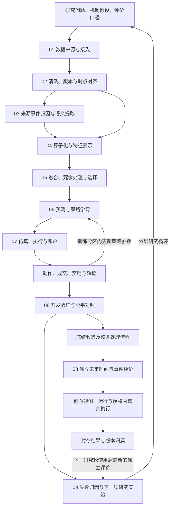

# 金融机器学习全生命周期架构

> **2026-09-17 当前讨论稿｜用于讨论与独立比较｜未批准实施、训练、部署或交易。** [文档索引](README.md)

## 1. 目标、原则与全局范围

**已明确要求：**建立能看清全局、逐步验证和有依据地改进的金融研究体系；以 BTC 最小实例贯通数据、表示、实际学习、完整交易决策、结果归因与下一轮实验。保留因子、主观机制假设、监督学习与 RL，不把研究自动化和交易决策强制变成二选一。

BTC 由用户选择，因为它可以同时暴露宏观/语义事件和微观结构带来的问题。首个实例仍需一种交易场所/工具定义；BTC 现货、永续及跨场所数据不是同一个账户和成交问题。

**设计建议：**以一套共用数据和评价口径连接可替换组件。优先复用现有数据、模型和仿真工具，不把九个职责直接拆成九个服务，也不预设一张巨型联合神经网络。稳定基础是来源、时间、数值运算、账户和评价规则，所有学习型模型都是有误差的候选。

## 2. 一张图看清全局

### 三条不能混淆的路径

1. **内层策略学习：**训练分区的观察 → 动作 → 订单/成交 → 账户奖励 → 参数更新。数值策略和语言工具策略的更新对象分别记录。
2. **外层研究反馈：**开发证据 → 诊断假设 → 选择数据/表示/训练或环境修改 → 实施实验 → 检查预测效果。更新研究记忆不等于更新研究 Agent 权重。
3. **独立评价：**冻结整条流程后使用未参与选择的未来时间/事件组。其结果若用于下一次改进，就成为下一轮开发证据，需要新的独立评价；不能无限复用一份“干净测试集”。

两种反馈相互连接，但独立评价不充当本轮研究的每步奖励。[AQuA v2](https://arxiv.org/html/2608.12841v2) 可参考研究循环，其因子和模型系统彼此独立且不更新基础 LLM 权重，不能据此认定联合交易学习已经解决。[RD-Agent-Quant](https://arxiv.org/abs/2505.15155) 提供因子/模型研发路径，也不自动证明本项目实盘效果。

## 3. 与四类产品工作的对应

| 产品工作 | 详细生命周期职责 | 可见结果 |
|---|---|---|
| 数据清洗 | 01 接入、02 清洗与时点控制 | 来源覆盖、原始记录、修复/缺失说明 |
| 数据整理 | 03 事件归属与语义、04 算子表示 | 事件证据、特征目录、当时可见的数据集 |
| 数据分析 | 05 融合选择、06 学习 | 模型及组合、训练产物、不确定性和对照 |
| 数据回测 | 07 环境账户、08 验证、09 归因反馈 | 成交净值、风险成本、失败实验及下一轮选择 |

真实执行、账户操作与运行监控承接这四类成果。界面需能串起“某条数据 → 某个特征 → 某次模型输出 → 动作 → 成交 → 评价/修改”；本稿只定义需要展示的证据，不代替此前完整前后端与审美要求。

## 4. 共用输入输出契约

以下是逻辑对象，不要求每个对象对应独立数据库或新服务。

| 对象 | 最小关键内容 | 生产者 → 消费者 |
|---|---|---|
| `HypothesisCard` | 问题、机制、可证伪预期、信息集、对照、成本/风险口径、预算、停止条件 | 研究 → 全流程 |
| `RawRecord` | 来源/记录标识、原始内容、版本、各类时间、取得方式、完整性 | 01 → 02/03 |
| `AlignedRecord` | 决策时点可用版本、缺失/过期、延迟假设和质量状态 | 02 → 03/04 |
| `EventEvidence` | 实体、事件、主张、原文证据、确认/修正/冲突关系、提取版本 | 03 → 04 |
| `FeatureSpec` / `FeatureFrame` | 公式/变换、输入来源、单位、窗口、拟合范围、可用时间、输出与缺失标记 | 04 → 05/06 |
| `FusionSpec` | 模态分组、选择/组合规则、训练范围、缺失策略、输出约定 | 05 → 06 |
| `TrainingRun` / `PolicyVersion` | 数据分区、学习对象、初始化与最终权重、配置、奖励、工具/提取版本 | 06 → 07/08 |
| `StepTrace` | 观察、模型版本、建议/实际动作、订单/成交、费用、持仓估值、奖励、时间 | 07 → 06/08/09 |
| `EvaluationBundle` | 对照条件、分区用途、成本净收益、风险、失败、统计不确定性 | 08 → 09/冻结 |
| `ResearchDecision` | 观测、候选原因、区分实验、预计变化、实际结果、保留/修改/淘汰 | 09 → 新研究轮 |

共用关联键为 `research_cycle_id`、`dataset_version`、`event_id`、`feature_version`、`policy_version`、`run_id`、`decision_id`。不存在的字段可以明确为空并给原因，不能补造历史接收时间或成交。

## 5. 时间、资金与学习的共同规则

- 输入应按其**实际可用时点**进入决策，不能只按经济事件发生时点连接。语义提取结束时间也是可用性的一部分。
- 清洗拟合、特征筛选、模型选择、研究记忆和策略训练共同受分区约束。任何一处看到最终结果，都可能污染整条流程。
- 模型建议和风险处理后的实际动作都保留；不能靠隐藏大量非法动作掩盖策略质量。
- 奖励由账户变化导出；未实现盈亏、费用、资金费和未成交都需有语义。没有新订单时，持仓仍可能盈亏。
- 数值 RL、LLM Agent RL、SFT 和固定模型推理分别标注。声称验证哪种学习，就提交对应的真实参数更新、可运行产物和对照。
- 生成情景用于辅助训练/压力测试时，单独标记来源，不能增加“独立真实市场样本”的计数。

## 6. 全局阶段定义

| 阶段 | 本阶段要建成什么 | 进入下一阶段的条件 |
|---|---|---|
| **最小 MVP** | 单 BTC、一个明确交易工具与场所；一条微观结构通道和一类宏观/语义通道；少量可追溯表示；实际学习；有成本账户；必要对照；至少完成一次有证据的后续实验；冻结及独立评价、前向执行方案 | 工程链条可追溯，已能定位主要失败；不足与经济结论被明确报告。真实交易只在另行具备授权与条件后执行，不以模拟冒充 |
| **第二步：针对失败补强** | 在同一 BTC 主线上修补被证据定位的数据、表示、融合、学习或执行问题；逐项验证变化，不自动增加市场和大模型 | 区分实验支持补强原因，预期改善在后续开发窗口成立且代价可接受；若无效，回退或淘汰假设 |
| **第三步：跨状态与运行验证** | 扩大独立市场状态/事件覆盖，检验延迟、成本、漂移与恢复；评估冻结/更新机制和前向差异 | 跨状态结果和运行证据支持目标用途；不足处继续标为未验证，不把短期盈利升级为长期结论 |
| **完整能力：可复用研究产品** | 可复用数据/算子/模型，能够管理多个研究任务、比较版本、追踪经济与运行结果并持续改进 | 按具体用途持续提供数据、学习、操作和经济证据；更多资产、场所、研究 Agent 参数 RL 或世界模型分别按收益与需求论证 |

每个阶段都保持完整生命周期。后续阶段不是把 MVP 缺失的“回测/反馈”补回来，而是在已有闭环上提高证据和适用范围。各环节的详细阶段内容见对应文档。

## 7. 复用边界与待讨论选择

数据框架、Qlib/现有树模型、通用序列模型和成熟执行引擎均为复用候选。依据实际接口和版本选择，先补必要接缝；不声称当前已经安装或打通。Agent 可以生成候选算子/训练实现，但需通过同样的数值和时间规则。

第一轮的关键选择见 [BTC-MVP.md](BTC-MVP.md)：场所与现货/永续、频率/延迟、数据覆盖、数值或语言策略学习配置、风险和经济判据。这些不阻止现在形成完整文档，但在运行相应实验之前必须实例化。不能通过默认值替用户选定杠杆、账户或真实资金。

此前的交付日期、完整前后端和训练后实盘要求仍在旧交付文档中。本套讨论稿未重排那些承诺；实施讨论需要结合当前实际进度和数据覆盖协调，不能把完成文档或模拟闭环报告为完成基金交付。
