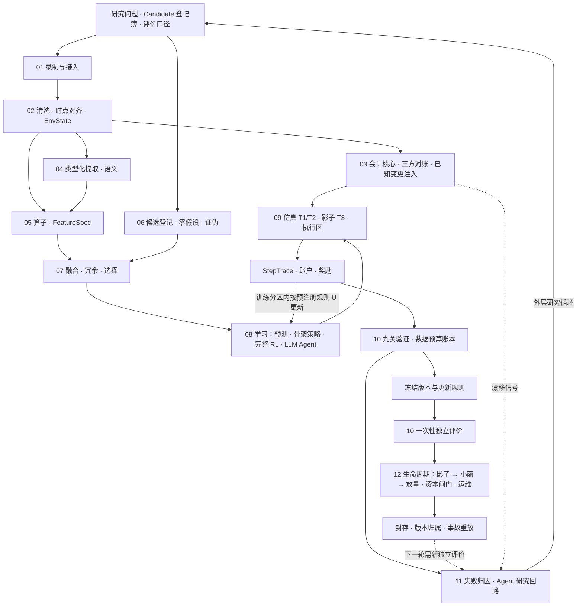

# 自进化交易研究系统：全生命周期架构

> **2026-09-18 当前讨论稿｜按 [UNIFIED-PLAN v1](../2026-09-18-unified-plan/UNIFIED-PLAN.md) 细化｜所有者已确认方案与三项裁定｜未批准实施。** 当前授权是编写本套文档；没有授权安装、录制、购买数据、训练、部署或交易。[文档索引](README.md) · [双轨 MVP 手册](MVP.md)

## 1. 目标、不变量与所有者裁定

**目标。** 建立能自我循环、自主发现机会、自我验证、自动化交易，且各环节同步进行的金融研究与交易系统。三层抽象：数据输入含写入规则与所处环境；抽象层的特征与表征自我验证，明确验证环境、特征与环境的匹配、特征之间的制约与组合；执行闭环在验证后交易并统一整条链路。AI 分两速：判断、循环反馈、决定进化方向由慢速推理 Agent 做；基于当前信息直接选择由快速类型化模型做。

**六条不变量**（来源与证据见 UNIFIED-PLAN §1）：

1. 每条输入按实际可用时刻进入决策，不按事件发生时刻。
2. Agent 与人的产出都是提议，落到预注册的机器可判定验收上；提议者不是裁判。
3. 参数与配置就是代码：版本控制、审批、实盘 diff。
4. 账本语义先于任何学习。
5. 每个验证探针配阳性对照与阴性对照，并报告假发现率与检出力。
6. 交易系统最珍贵的能力是不交易。

**所有者裁定（2026-09-18）。**

| 事项 | 裁定 | 对本套文档的含义 |
|---|---|---|
| 工期 | 改约。10 月 15 日交付范围为：录制基础设施与数据覆盖报告、会计核心与三方对账 CI、两轨历史复现与已知信号恢复结果、两轨自适应基线的 T1 评价、影子运行起点、工作台数据/机会/验证三视图连真实接口。训练后策略实盘按 [MVP.md](MVP.md) §6 路径，最早约 11 月中旬；规则式基线与 SFT/RL 策略分别计时 | 所有环节的"最小 MVP"列以 10 月 15 日可交付项为边界；"15 到 20 天实盘"不再是 10 月的验收项 |
| LLM Agent RL | 保留为交付项，走同一九关，不给关键路径豁免 | [08 学习](08-LEARNING.md)保留配置 L 的真实 SFT 与 Agent RL 训练；上线条件与骨架策略相同 |
| 主体资格 | 先核实交易主体司法辖区与账户资格；Polymarket 轨道以资格与数据条件为前提 | [01 录制](01-DATA-RECORDING-INGESTION.md)与 [09 执行](09-SIMULATION-EXECUTION.md)把资格核实列为第 0 周任务；Polymarket 只在第二档录制 |

## 2. 一张图看清全局

### 三条不能混淆的路径

1. **内层算法回路**：训练分区的观察 → 动作 → 订单/成交 → 账户奖励 → 按预注册更新规则 U 更新参数。冻结的是版本与 U，不是永久冻结权重。
2. **外层 Agent 研究回路**：开发证据 → 诊断 → 选择数据/表示/训练/环境的修改 → 实施区分实验 → 检查预期。更新研究记忆不等于更新 Agent 权重。
3. **独立评价**：冻结整条流程后用未参与选择的时间/事件簇评价，holdout 只开一次；结果若用于改进即变为开发证据，下一轮需新的独立评价。

## 3. 与三层抽象和四类产品工作的对应

| 你的三层 | 环节文档 | 四类产品工作 | 可见结果 |
|---|---|---|---|
| 数据输入（含写入规则与环境） | 01 录制、02 对齐与 EnvState、03 会计核心 | 数据清洗 | 覆盖报告、RawRecord、AlignedRecord、EnvState、对账报告 |
| 抽象层（特征自我验证、环境匹配、互相制约） | 04 提取、05 算子、06 候选登记、07 融合 | 数据整理、数据分析（前半） | EventEvidence、FeatureSpec 三态有效域、Candidate 状态、FusionSpec |
| 执行闭环 | 08 学习、09 仿真与执行、10 验证、11 反馈、12 生命周期 | 数据分析（后半）、数据回测、实盘运行 | PolicyVersion、StepTrace、EvaluationBundle、ResearchDecision、生命周期状态 |

## 4. 共用对象契约

以下是逻辑对象，不要求每个对象对应独立数据库或新服务。字段级定义在对应环节文档；本表是权威名称表，其他文档引用不另立。

| 对象 | 最小关键内容 | 生产者 → 消费者 | 定义位置 |
|---|---|---|---|
| `RawRecord` | 来源/记录标识、原始内容、版本、六时间字段、取得方式、完整性、本地接收时间 | 01 → 02/04 | 01 |
| `AlignedRecord` | 决策时点可用版本、缺失/过期、延迟假设、质量状态 | 02 → 03/04/05 | 02 |
| `EnvState` | `spec_version`（含 DEX/部署者/抵押品配置）、市场状态桶、会话状态、数据质量、外部参考源健康 | 02 → 全流程 | 02 |
| `AccountingSpec` / `ReconciliationReport` | 按 DEX 版本的 funding/margin/liquidation/ADL/bounds 公式；三方对账差异、已知变更注入结果 | 03 → 09/10/11 | 03 |
| `EventEvidence` | 实体、事件、主张、原文证据、关系、`extractor_version`、校准审计、Lookahead Propensity、提取完成时刻 | 04 → 05 | 04 |
| `FeatureSpec` / `FeatureFrame` | 公式、输入、单位、窗口、`fit_scope`、可用时间、`validity_env` 三态、`probe_results`、`causal_declaration`、`extractor_version` | 05 → 07/08 | 05 |
| `Candidate` | 八项必填：机制引用、可证伪预期、零假设、证伪脚本、阈值哈希、试验次数上限、环境适用范围、数据预算；状态机 | 06 → 07/08/10/12 | 06 |
| `FusionSpec` | 模态分组、选择/组合规则、训练范围、缺失策略、冗余组/共同暴露/条件互补记录 | 07 → 08 | 07 |
| `TrainingRun` / `PolicyVersion` | 数据分区、学习对象、初始与最终权重、配置、奖励、工具版本、更新规则 U、轨道标识 A/B | 08 → 09/10 | 08 |
| `StepTrace` | 观察、模型版本、建议/实际动作、订单/成交、费用、持仓估值、奖励、时间、`EnvState` | 09 → 08/10/11 | 09 |
| `EvaluationBundle` | 对照条件、分区用途、三类检验结果、假发现率、成本净收益、风险、失败、不确定性 | 10 → 11/12 | 10 |
| `ResearchDecision` | 观测、候选原因、区分实验、预计变化、实际结果、保留/修改/淘汰、试验计数 | 11 → 新研究轮 | 11 |
| `LifecycleState` | 候选所处状态、转移证据、资本份额、kill switch 级别、放量规则 | 12 → 全流程 | 12 |

共用关联键：`research_cycle_id`、`track_id`（A/B/C）、`dataset_version`、`env_state_id`、`event_id`、`event_cluster_id`、`feature_version`、`candidate_id`、`policy_version`、`run_id`、`decision_id`、`spec_version`。不存在的字段明确为空并给原因，不补造历史接收时间或成交。

## 5. 两速 AI 的权限矩阵（全局版）

| 环节 | 慢速推理 Agent | 快速类型化模型 | 数值模型 | 裁决者 |
|---|---|---|---|---|
| 读文档、公告、论文，起草 spec 与算子 | 提议 | — | — | 对账 CI 加已知变更注入 |
| 事件提取 | 离线标注与 schema 设计 | 在线主力，带校准审计与 `extractor_version` | — | 人工核查样本加下游增量消融 |
| 候选机会提议 | 提议，八项必填 | 初筛路由 | — | schema 校验加证伪脚本 |
| 特征工程与融合 | 提议代码 | — | 拟合 | G1、G4、G5 |
| 预测 | — | — | 主力 | 独立记账的 PIT/CRPS |
| 动作选择 | 可作候选（LLM Agent 策略） | 可作受约束选择器候选 | 骨架加少量参数为默认 | 同信息同预算比较，G3 到 G6 |
| 下单、风控、私钥 | 只提交意图 | 只提交意图 | 只提交意图 | 确定性执行层：事前限额、独立签名进程 |
| 失败归因与下一项实验 | 提议，含可反驳预期 | — | — | 区分实验的实际结果 |
| 阈值、分区、holdout 开启 | 不可 | 不可 | — | 预注册哈希加 CI |

各环节文档第 6 节给出本环节的局部权限表；与本表冲突以本表为准。

## 6. 九关验证栈（全局定义）

| 关 | 检查 | 性质 | 不过意味着 |
|---|---|---|---|
| G0 | 账本一致性：三方对账在覆盖区间内逐笔对齐，已知变更注入全部检出 | 阻断依赖该账本的上线 | 先修 spec 或适配器 |
| G1 | 已知信号恢复：注入未来收益的探针被学会 | 阻断基于该学习路径的新算法 | 先修该学习路径 |
| G2 | 信息天花板度量 | 诊断，不阻断 | 提示换信息集优于换模型 |
| G3 | 基线公平实现且参数经优化（不要求基线正期望） | 阻断 | 后续任何"优势"无意义 |
| G4 | 跨 ≥10 随机种子的分布 | 阻断 | 差距被方差淹没，记为负面结果 |
| G5 | 全流程假发现率与检出力：多组零预测能力合成数据上整条流水线的通过率与费用后收益分布 | 阻断 | 流程有泄漏或选择偏差 |
| G6 | 冻结版本与更新规则 U 后一次性独立评价 | 阻断 | 无合格候选，如实报告 |
| G7 | 影子 ≥4 周且跨一次高波动事件，机械层偏差可归因 | 阻断 | 状态重建有系统性错误 |
| G8 | 小额实盘偏差可归因，连续 N 日无不可归因偏差才放量 | 阻断 | 停 |

**三类检验分开回答三个问题**：历史原样复现回答数据管线是否一致；已知信号恢复回答学习路径是否健康；前向经济检验回答有没有 edge。任何一类不能替代另一类。

## 7. 时间、资金与学习的共同规则

- 输入按实际可用时点进入决策；语义提取结束时间是可用性的一部分。
- 清洗拟合、特征筛选、模型选择、研究记忆、策略训练共同受分区约束；任何一处看到最终结果都可能污染整条流程。
- 模型建议与风险处理后的实际动作都保留。
- 奖励由账户变化导出；未实现盈亏、费用、资金费、未成交都有语义。
- 数值 RL、LLM Agent RL、SFT、固定模型推理分别标注；声称验证哪种学习就提交对应的真实参数更新、可运行产物与对照。
- 生成情景单独标记来源，不增加"独立真实市场样本"的计数。
- 数据预算账本的货币是**独立事件簇**，不是 K 线数，也不是市场数。

## 8. 全局阶段定义

| 阶段 | 本阶段要建成什么 | 进入下一阶段的条件 |
|---|---|---|
| **最小 MVP**（对应 10 月 15 日改约交付） | 双轨录制第一档；会计核心与三方对账 CI 通过已知变更注入；两轨历史复现与已知信号恢复；两轨自适应基线的 T1 评价；G5 假发现率报告；影子运行起点；工作台三视图 | 每个环节有对应产物与状态；经济失败与前向不足能被诚实识别；实盘只在 G7 之后 |
| **第二步：针对失败补强** | 在同一双轨上修补被证据定位的数据、表示、融合、学习或执行问题；逐项验证；不自动增加市场与模型 | 区分实验支持补强原因；预期改善在后续开发窗口成立且代价可接受；无效则回退 |
| **第三步：跨状态与运行验证** | 扩大独立事件簇与市场状态覆盖；检验延迟、成本、漂移与恢复；影子跨高波动事件；小额实盘与分层放量 | 跨状态结果与运行证据支持目标用途；不足处标为未验证 |
| **完整能力：可复用研究产品** | 可复用数据/算子/模型/会计 spec，管理多个研究任务与轨道，比较版本，追踪经济与运行结果；研究 Agent 参数 RL 按需求论证 | 按具体用途持续提供数据、学习、操作和经济证据 |

每个阶段都保持完整生命周期；后续阶段不是补回 MVP 缺失的"回测/反馈"，而是在已有闭环上提高证据与适用范围。

## 9. 复用边界与本套文档的权威关系

- 复用候选：NautilusTrader 2.x（执行内核、事件溯源、DST）、Parquet 加 DuckDB/Polars、Iceberg 或 ArcticDB、Metaflow 或 DVC、MLflow 只记录、TRL/PEFT 与 Agent Lightning/verl 用于配置 L、微调小编码器用于提取。依据实际接口与版本选择；不声称当前已安装或打通。
- 决策依据与证据在 [UNIFIED-PLAN v1](../2026-09-18-unified-plan/UNIFIED-PLAN.md) 与其 `evidence/` 附录；本套文档不重复论证，只引用。
- 全局阶段定义由本文维护；双轨实例参数由 [MVP.md](MVP.md) 维护；局部细节由各环节文档维护；验收规则由 [10 验证](10-VALIDATION-GATES.md) 维护。其他文档引用这些定义，不建立竞争性主 SPEC。
- 旧文档 `thinking/onchain-rl-trading` 与 `2026-09-17-bitcoin-full-lifecycle` 作为历史保留；与本套冲突处以本套为准，冲突清单见 UNIFIED-PLAN §12。
