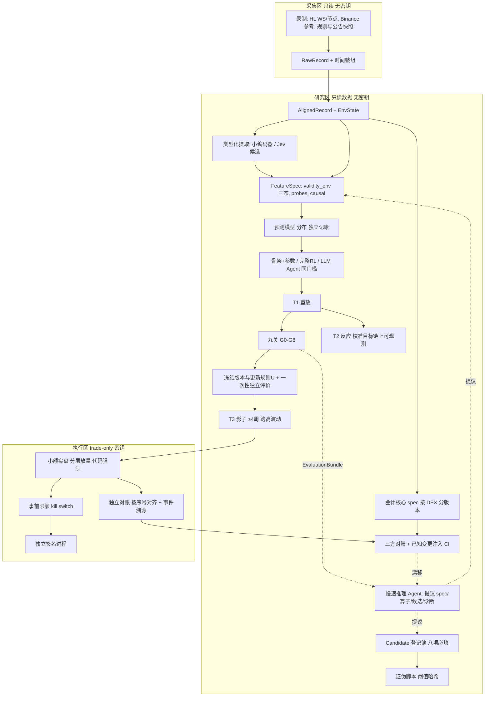

# 自进化交易研究系统：统一落地方案（终极讨论稿 v1）

> 2026-09-18。状态：**v1 终稿，所有者已确认并裁定三项待决事项（见 §0）；Claude 整合，已合入 Codex 两轮评议**（`rounds/codex-round1.md`、`rounds/codex-round2.md`）。授权范围：本轮只写文档；未安装、未录制、未训练、未交易。
> 证据标记：✅ 一手来源已读 ｜ 🟡 二手、摘要或受限索引 ｜ ❌ 未找到。方括号内为证据附录编号与章节，例如 [E1 §5] 指 `evidence/01-institutions-2020-2026.md` 第 5 节。附录中部分 ✅ 标记由研究代理给出，Codex 第二轮指出其中有媒体报道与论文摘要被标为一手；终稿对决定性主张已重新核验，其余按附录原标记保留并在此声明这一局限。
> 本稿整合 `thinking/onchain-rl-trading`（2026-09-07 机制派）与 `documents/discussions/2026-09-17-bitcoin-full-lifecycle`（生命周期派），不替代它们作为历史记录。凡本稿与旧文档冲突处以本稿为准，冲突点在 §12 列明。

## 0. 一页结论

**一句话方案。** 把两套框架合成一条流水线：数据层给每条记录完整的时间戳组和一个环境标签；抽象层让每个特征、每个假设都带着"在哪种环境下被什么探针检验过"的证据；执行闭环用会计核心、三方对账加已知变更注入，把仿真、影子和实盘钉在链上真值上。AI 分两速：慢速推理 Agent 在离线研究回路里提议、写码、诊断，不裁决、不下单；快速类型化模型在在线路径上做提取、路由、门控，也可以作为受约束的动作选择器候选参加同门槛比较，但任何模型都只能向确定性执行层提交意图，由执行层签名。自进化有两条回路：Agent 回路更新假设、代码和记忆；算法回路按预注册规则更新参数。两条回路都不能碰最终留出集。并行发生在候选之间与市场宽度上，同一候选内部冻结的是版本与更新规则，不是永久冻结权重。

**五个关键决策。**

| # | 决策 | 结论 | 主要证据 |
|---|---|---|---|
| 1 | AI 的位置 | 推理 Agent 提议不裁决；类型化快模型做信息接口，并可作受约束选择器候选；所有模型只提交意图，执行层持有权限；LLM Agent RL 交易策略保留为交付项，但上线走同一九关 | Man AlphaGPT 同门槛 ✅ [E1 §5]；Balyasny"控制在模型外" ✅ [E1 §12]；Alpha Illusion、Profit Mirage、StockBench、AlphaForgeBench ✅ [E2 §D]；HRT 预测/控制分离 ✅ [E1 §8] |
| 2 | 验证的性质 | 验证消耗独立的未来数据；评估器上锁、holdout 只开一次、试验数入账；每个探针报告假发现率与检出力 | Shin 2026 ✅、DSR/PBO/CPCV ✅ [E2 §A]；Quantopian 888 策略 R²≈0.01 ✅ [E4 Q1]；Two Sigma"瓶颈在评估" ✅ [E1 §4] |
| 3 | 首个实例 | **同一场所双轨，A 主线 B 支路**：Hyperliquid BTC 普通永续为主线 A（ETH 作迁移检验）；HIP-3 会话重开为预算受限的比较支路 B（建议 ≤20% 工程工时，前三个工程日核清历史覆盖与成本）；共用采集、会计核心、对账、`EnvState`、九关；Polymarket 第三轨道 | Blockworks Research 2026-08 ✅（本轮直接核验）；BTC 价格发现在 Binance ✅ [E3 Q4]；Polymarket 无官方历史簿、UMA 争议、多腿非原子 ✅🟡 [E3 Q2]；Codex 两轮 |
| 4 | 工程形态 | 模块化单体，按权限分区；Parquet 加 as-of join 加不可变版本化；Nautilus 2.x 做执行内核，自有会计核心并行对账；组件按必要能力取最少 | Nautilus 架构与事件溯源 ✅ [E4 Q4]；ArcticDB/Tecton/Iceberg ✅ [E4 Q2]；Knight、Hummingbot、Nautilus 重启重复订单 ✅ [E4 Q5]；Kraken 一进程一 key ✅ [E4 Q7] |
| 5 | 风控与托管先于策略 | 私钥分权、trade-only key、独立签名进程、每日链上对账、决策留痕、按部署者限敞口 | FTX Ray 声明 ✅、Wintermute、Two Sigma、Jane Street SEBI ✅ [E1 §2 §4 §10]；Bybit 盲签 🟡 [E3 Q6] |

**所有者裁定（2026-09-18，讨论后）。** 所有者确认方案，并对下列三件事采纳本稿建议：(1) 改约，10 月 15 日交付范围按 §9"改约"项，训练后策略实盘按 §8.2 路径另定日期；(2) LLM Agent RL 保留为交付项，走同一九关，不给关键路径豁免；(3) 先核实交易主体司法辖区与账户资格，Polymarket 轨道以资格与数据条件为前提。细化文档集见 `../2026-09-18-unified-full-lifecycle/`。

**三件曾需拍板的事（已按上项裁定）。**

1. **工期冲突。** 本方案的最短路径是 4 周建设加 4 周影子，最早 11 月中旬才有小额实盘；基金文档要求 10 月 15 日前交付并含 15 到 20 天训练后策略实盘。两者不相容，见 §9。
2. **LLM Agent RL 的地位。** 你已明确扩大范围，本稿保留它为交付项，但按证据把它放在同一九关之下、不给关键路径豁免。若基金合作前提是它先上线，这是需要你决定的改约。
3. **交易主体的司法辖区。** Polymarket 官方地域限制把 30 多个国家和地区设为"前端与 API 仅可平仓" ✅ [E3 Q2]，这决定第三轨道是否存在；A、B 两轨同样要核实实际主体与账户资格。

## 1. 目标与不变量

**目标（你的原话要点）。** 自我循环、自主发现机会、自我验证、自动化交易，各环节同步进行。三层抽象：数据输入含写入规则与所处环境；抽象层的特征和表征都要自我验证，明确验证环境、特征与环境的匹配、特征之间的制约与组合；执行闭环在验证后交易并统一整条链路。AI 分两类：判断、循环反馈、决定进化方向由推理型 AI 做；基于当前信息直接选择由快模型做。

**六条不变量。**

1. 每条输入按实际可用时刻进入决策，不按事件发生时刻。Tecton 的 effective timestamp、Two Sigma 的数据即代码、Man ArcticDB 的时间旅行指向同一件事 ✅ [E4 Q2]。
2. Agent 和人的产出都是提议，落到预注册的机器可判定验收上。Man Group 的 Evaluator 与"AI 或人产生的信号必须通过相同阈值"是现成蓝图 ✅ [E1 §5]。
3. 参数和配置就是代码。Two Sigma 因参数库无审批写权限被罚 $90M 并退还 $165M ✅ [E1 §4]。
4. 账本语义先于任何学习。
5. 每个验证探针配阳性对照与阴性对照，并在 CI 里报告假发现率与检出力，不只报告一次通过。
6. 交易系统最珍贵的能力是不交易，这是 Jane Street 的原话 ✅ [E4 Q1]。

**"同步进行"的准确含义。** 发现、验证、交易同时运行，作用在不同候选上：候选 N 在实盘，N+1 在独立评价，N+2 在证伪，N+3 在被提议。同一候选内部冻结的是版本与预注册的更新规则 U，允许标签成熟后按 U 更新；研究者看过评价后修改 U 才产生新候选。验证吞吐不能靠加机器提高，因为它消耗的是独立的未来数据。并行应发生在市场宽度上，但**市场数不等于独立样本**，事件必须按共同冲击聚簇后计数；本稿不预先给出倍数，实际事件簇数与检验功效在录制后报告。

## 2. 证据基础摘要

四份证据附录共约 200 条带来源主张。这里只提对决策有决定性影响的，并按 Codex 第二轮纠正了表述范围。

**机构 2020–2026** [E1]：所调查的机构一致表述 AI 先兑现在研究吞吐而非 alpha，瓶颈移到评估（Man、Two Sigma、Balyasny ✅）；所调查的案例中没有一家给 AI 信号降低门槛；参数与配置的变更控制缺失在传统与加密案例中都是致命点（Two Sigma、FTX ✅）；regime 切换是风险模型的天敌，RenTech 2020 外部基金约 −20% 到 −32% 而 Medallion +76% ✅ [E1 §3]；过拟合被工业化，一位 WorldQuant BRAIN 前 0.04% 参与者的自报样本显示样本内 Sharpe ≥3.5 的 alpha 中 44% 已衰减 ✅（个人一手数据，非官方统计）[E1 §7]；算力是大厂护城河，XTX 25,000 GPU、€1bn 数据中心 ✅ [E1 §8]，本稿由此建议小团队在数据清洁与验证纪律上取胜，这是策略建议不是全称定律；监管与对手方是隐性尾部，Jane Street 被临时冻结约 $567M 且终局未出 ✅、BlockFills 2026 年 3 月破产 ✅ [E1 §2 §10]。

**学术 2023–2026 反面证据** [E2]：对 LLM 端到端交易代理，Alpha Illusion 的准确表述是现有证据**尚不能区分**真能力与污染 ✅；Profit Mirage 报告跨知识截止后 Sharpe 衰减 51% 到 62%，但有时期混杂 ✅；StockBench 无污染环境中多数代理跑不赢买入持有 ✅；AlphaForgeBench 发现 LLM 逐步决策即使确定性解码也出现动作翻转 ✅。复杂度之德受到 Buncic 与 Nagel 的实质挑战，作者有回应，争论未终结 ✅🟡；本稿据此把线性加收缩作为默认基线，不把"大模型无效"当结论。提示词声明截止日期不能消除前视，DatedGPT 量化出每 1σ 约 26.4bp 的前视溢价 ✅。Jev 的官方准确率是与两个 LLM 的一致率而非人工真值，**未找到**公开独立校准审计 ✅🟡。

**学术正面理念** [E2]：评估器上锁加搜索后一次性 holdout ✅；订单流在加密特征中有同行评审支撑，但该研究用中心化交易所买卖量、非纯链上指标 ✅🟡；文本到有类型字段是 LLM 的稳定优势区 ✅；微调 300M 编码器在金融抽取任务上与 GPT 级持平且便宜 1 到 2 个量级 ✅；以交易目标训练、以经济结构正则化 ✅；朴素方向策略在 10bp 成本下失效，加成本感知过滤后恢复正收益但未显著胜过买入持有 ✅。

**场所与数据** [E3 与本轮核验]：Hyperliquid 官方 S3 有 L2 快照、asset contexts、节点 fills、区块与非交易事件，约每月上传一次、可能缺失，官方建议自行录制 ✅；公共 WS 有 fast/slow 两档簿与逐块 BBO，每 IP 1000 订阅上限不因多开连接而解除，2000 条/分是发送限制 ✅（Codex 核验）；HL 原生 perp 基础档 taker 0.045%、maker 0.015%，HIP-3 部署者可设 0 到 300% 费率比例，growth mode 减免 ≥90% ✅（本轮直接读官方费用页）；HIP-3 约 144 个在线 builder 市场，trade.xyz 占约 95% 成交 🟡；2026-07-28 SKHYNIX 闪崩 4 秒内 oracle 跌约 15%，约 960 个多头被清算 🟡。**Blockworks Research 2026-08-03**（作者 Shaunda Devens，Hyperliquid Policy Center 资助）：614 个市场周末来自 68 市场、17 次闭市，筛选周末成交 ≥$1M 且检查点完整；周末价格在 70.7% 的市场周末上比"收盘价不变"更接近重开价，跳幅 >100bp 时方向正确 94.9%；"84% 在 5 分钟内回到 oracle 10bp 内"来自另一组 100 次最近重开的子样本 ✅（本轮直接核验；旧文档与附录 E2 原写作 Messari 是错误，已更正）。Polymarket 2026-04-28 切到 CLOB V2，官方历史订单簿不存在 ✅；UMA 争议今年已超 1,150 起 🟡；Nautilus Polymarket 适配器不支持 `reduce_only`、批量最多 15 笔、非原子 ✅。BTC 价格发现在 Binance，Hyperliquid 信息份额约 17% 到 37% ✅。NautilusTrader 最新为 2.0.0rc5 预发布，1.231.0 是最后的 1.x ✅。

## 3. 统一抽象

### 3.1 数据层

每条记录六个时间字段，沿用生命周期派 02 文档：`event_time`、`published_at`、`first_observed_at`、`processing_ready_at`、`usable_at`、`retrieved_at`。决策只读 `usable_at <= t` 的最新版本。历史回填没有真实接收时间时附延迟假设并标明。

**`EnvState`** 是你说的"环境"的落点，四组字段：场所规则版本（`spec_version`，含部署者与抵押品配置）、市场状态桶（波动、深度、资金费分位）、会话状态（HIP-3 的 external/internal、距重开时长、discovery bounds 剩余空间、重锚定计数、外部参考源健康）、数据质量（缺失、过期、延迟假设）。观察、特征快照、评价结果都带 `EnvState` 标签。环境只能用决策时可观测量定义；事后的牛熊分组只能作诊断。

### 3.2 抽象层：特征、假设、验证

**`FeatureSpec`** 在 04 文档契约上加四个字段：

- `validity_env`：按 `EnvState` 桶记录三态之一：有效、反证成立、证据不足。部署时可以保守地拒用后两态，但不把"证据不足"写成"已失效"。
- `probe_results`：阳性对照、阴性对照、point-in-time 测试、DSR、跨 seed 稳定性的结果与版本。
- `causal_declaration`：机制假设、控制变量、禁止的控制项 ✅ [E2 §A]。
- `extractor_version`：由模型产生的特征记录模型、提示、schema、截止日期与 Lookahead Propensity 诊断值 ✅ [E2 §C]。

**特征之间的制约**：冗余组、共同暴露、条件互补三种关系，消融结果写回 `FeatureSpec`。

**`Candidate`** 合并机制派登记簿与 `HypothesisCard`，八项必填：机制引用、可证伪预期、零假设、证伪脚本、阈值哈希、试验次数上限、环境适用范围、数据预算。缺一项程序拒收 ✅ [E4 Q3]。

**探针的准确地位。** 注入已知信号的探针诊断"这条学习路径能否恢复已知信号"，失败时先定位并修复该路径、暂停基于它的新算法工作，不宣判信息天花板。信息天花板度量是诊断量而非闸门，因为机制派旧文档给出的公式没有附带对本项目成立的条件与误差界（Codex 两轮均指出，成立）。

**三类检验分开回答三个问题**：历史原样复现（我们的数据能否重现别人测过的效应，回答数据管线是否一致）；已知信号恢复（注入信号能否被学会，回答学习路径是否健康）；前向经济检验（冻结版本在成本后是否有净增量，回答有没有 edge）。任何一类不能替代另一类。

**验证栈九关**：G0 账本一致性；G1 已知信号恢复；G2 天花板度量（诊断，不阻断）；G3 基线公平实现且参数经优化（不要求基线正期望，否则会排除"基线无优势而候选有优势"的情形）；G4 跨 ≥10 seed；G5 全流程假发现率与检出力：在多组零预测能力合成数据上运行整条流水线，报告通过率与费用后收益分布，而不是要求单次区间恰好覆盖零；G6 冻结后独立评价，holdout 只开一次；G7 影子 ≥4 周且跨一次高波动事件；G8 小额实盘偏差可归因。放行门槛用 DSR/PBO，按误检与漏检成本比设定 ✅ [E2 §A]。

### 3.3 学习层

- **预测模型**输出分布，独立记账。默认线性加收缩与树模型作基线；复杂模型须以经济显著幅度胜出，理由是低信噪比下的 complexity wedge 与对复杂度之德的现有挑战 ✅🟡 [E2 §B]。
- **策略**默认是结构化骨架加少量可学参数，理由是 HRT 的预测与控制分离便于风控 ✅ [E1 §8] 与文献中自由出价 RL 的负面记录。这是默认，不是禁令：完整 RL 策略与 LLM Agent RL 策略作为候选进入同一九关，与骨架策略同门槛比较。
- **提取模型**把文本变成有类型字段。首选微调小编码器或 LoRA 小模型；Jev 类模型作候选进同一校准审计 ✅ [E2 §E]。历史回测中的文本特征用 point-in-time 语言模型作对照与诊断（不是效果的数学下界）✅ [E2 §C]；输入去实体化作诊断，不当作去污染证书 ✅。

**LLM Agent RL 交易策略**。你已明确扩大范围，本稿保留真实 SFT 与 Agent RL 权重训练为交付项，理由是它是所有者目标且有正面研究方向（FLAG-Trader、Trading-R1 🟡）。同时，最严格的评估尚不能区分其报告 alpha 是能力还是污染 ✅ [E2 §D]，所以它不获得关键路径豁免：与骨架策略、数值 RL、SFT-only 同信息同预算比较，通过九关才上线。若合作前提要求它先上线，这是改约问题，见 §9。

### 3.4 执行闭环

- **会计核心**：funding（原生与 HIP-3 两套 premium 公式）、margin 分档、liquidation、ADL、约束，加 HIP-3 discovery bounds v2 与部署者级参数。每个 HIP-3 DEX 有独立保证金、部署者设置与抵押品选择 ✅（Codex 核验 HIP-3 规范），spec 按 DEX 分版本。
- **三方对账**：会计核心 vs Nautilus 账户状态 vs 链上真值。三方一致不能排除共同输入错误，所以配两件事：独立规则案例集（含已知历史清算、资金费结算的手算样本），以及**已知变更注入**（人为改 impact notional、维持保证金率、clamp 边界，对账必须报警），用注入证明检测能力，再归因真实差异。每日 CI，失败阻断相关轨道上线。
- **执行内核**：NautilusTrader 2.x，backtest/sandbox/live 共享内核，事件溯源，确定性仿真 ✅ [E4 Q4]；自有策略与适配器独立包，记录 LGPL 边界。独立 REST 对账循环按序号与时点对齐，保留差异记录，查询未确认订单后再重试；不做盲目的绝对仓位覆盖，因为它会与更新的成交竞态（Codex 第二轮）；order id 幂等只保护客户端，服务端幂等要按场所核实。
- **三档保真度**：T1 重放；T2 反应环境须有链上可观测校准目标；T3 影子。

### 3.5 两条自进化回路

| 回路 | 更新什么 | 输入 | 污染防线 |
|---|---|---|---|
| Agent 研究回路 | 假设、特征代码、算子、下一项实验、研究记忆 | 开发分区的 `EvaluationBundle`、失败归因、外部文献与公告 | 评估器在 Agent 权限外；只读开发结果；试验计数必填；多模型并行采样，Man 实测 Claude 提案相关 >0.85 ✅ [E1 §5]；外部文本可促成提议不能授权变更 |
| 算法回路 | 预测器权重、骨架参数、完整 RL 策略、预注册更新规则 U | 训练分区轨迹与仿真 rollout | U 本身是被评价对象；标签未到期不更新；世界模型不能用自身生成数据证明自身 |

研究 Agent 自身的参数 RL 留待累积足够研究轨迹之后。Two Sigma 的警告值得记住："自主 agent 会无情优化代理目标" ✅ [E1 §4]。

## 4. 两速 AI 的权限矩阵

| 环节 | 慢速推理 Agent | 快速类型化模型 | 数值模型 | 裁决者 |
|---|---|---|---|---|
| 读文档、公告、论文，起草 spec 与算子 | 提议 | — | — | 对账 CI 加已知变更注入 |
| 事件提取 | 离线标注与 schema 设计 | **在线主力**，带校准审计与 `extractor_version` | — | 人工核查样本加下游增量消融 |
| 候选机会提议 | 提议，八项必填 | 初筛路由 | — | schema 校验加证伪脚本 |
| 特征工程与融合 | 提议代码 | — | 拟合 | G1、G4、G5 |
| 预测 | — | — | 主力 | 独立记账的 PIT/CRPS |
| 动作选择 | 可作候选（LLM Agent 策略） | 可作**受约束选择器候选** | 骨架加少量参数为默认 | 同信息同预算比较，G3 到 G6 |
| 下单、风控、私钥 | 只提交意图 | 只提交意图 | 只提交意图 | 确定性执行层：事前限额、独立签名进程 |
| 失败归因与下一项实验 | 提议，含可反驳预期 | — | — | 区分实验的实际结果 |
| 阈值、分区、holdout 开启 | 不可 | 不可 | — | 预注册哈希加 CI |

对你原话的精确修正。"基于当前信息直接选择"可以交给类型化、可校准、有状态的快模型，也允许通用 LLM 参加同任务比较；证据不支持的是默认让通用 LLM 做逐步决策：AlphaForgeBench 的动作翻转 ✅ [E2 §D]，Jensen"LLM 是糟糕的规划者" ✅ [E1 §6]。Jev 类模型是这一格的候选，但类型正确不是决策优势的证明，我们要用自己的标注集做校准审计，样本量按类别与稀有风险事件确定，并给出接受区间。

## 5. 并行：候选生命周期与数据预算

**状态机**：候选 → 证伪中 → 已确认 → 冻结 → 独立评价 → 影子 → 小额实盘 → 放量 → 退役。任意状态可回退；转移由代码判定。Numerai 用质押作准入、24 个重叠 round 同时评审 ✅ [E4 Q8]。

**数据预算账本**：每段 holdout 只花一次。货币是**独立事件簇**：同一周末的多个重开共享宏观与流动性冲击，按日期或 regime 聚簇后计数。多个预登记候选可以共用同一前向窗口，前提是把选择纳入评价并计入多重试验 ✅ [E2 §A]。两轨的候选数、试验数、费用、停止日期与选择规则预登记。

**资本闸门**：硬风险停止（回撤、集中度、对账红灯）由代码强制；策略统计复评（实盘相对影子的偏离）用预注册的序贯监测规则，本稿不给"Sharpe 低于一半即停"这类未论证阈值。Bridgewater 先以约 $100M sleeve 试跑再放大 ✅ [E1 §6]。

## 6. 工程落地

**形态：模块化单体，按权限分区。** 三个权限区：采集只读无密钥；研究只读数据无密钥；执行持 trade-only 密钥，私钥不出签名进程。分区是权限边界，不预设机器数与进程数；按必要能力选最少组件。理由：Nautilus"一节点多策略、隔离才分进程" ✅ [E4 Q7]；Kraken"一进程一 API key" ✅；机构级"三区"论证未找到 ❌，这是推论。

**数据平面**：Parquet 加 DuckDB/Polars as-of join，版本化用 Iceberg tag 或 ArcticDB；特征表三列时间 `event_ts`、`available_ts`、`ingest_ts`，只按 `available_ts` 做 backward as-of ✅ [E4 Q2]。

**研究管线为一等版本对象**：Metaflow 或 DVC 冻结代码、配置、数据指针；MLflow 只记录；阈值作哈希锁定元数据 ✅🟡 [E4 Q3]。Kedro、Dagster、Prefect 是编排器，不冻结外部数据。

**CI**：三方对账加已知变更注入；已知信号恢复；全流程假发现率。静态 lint 查 `shift(-n)`、`center=True`、`bfill`、切分前拟合，作为提示而非证明；prefix-invariance 测试保证未来数据变化不改过去特征 🟡 [E4 Q2]。Agent 生成代码只通过白名单特征工具访问数据 🟡 [E4 Q6]。

**密钥与托管**：采集用只读 key；执行用 trade-only 加 IP 白名单，永不开提币；HL agent 钱包只能下单不能提币，一策略一 agent 🟡 [E3 Q6]；主账户硬件多签；签名机独立于交易构造 UI 并做载荷校验，Bybit 2025 年 2 月约 $1.5B 损失来自签名人盲签 🟡；权限撤销清单化 ✅ [E1 §10]。

## 7. Full Picture

## 8. MVP：双轨、预算与计划

### 8.1 首个实例的决策

候选四个：(a) BTC/ETH 方向或条件交易；(b) Polymarket 内部逻辑组合套利；(c) HIP-3 会话重开收敛；(d) HL 与 Polymarket 跨场所相对价值。

**结论：同一场所双轨，A 主线、B 受预算约束的支路。**

- **轨道 A（主线）**：Hyperliquid BTC 普通永续，ETH 作迁移检验。连续型任务，一小时预测与持有期起步，输入订单流、资金费、市场状态与类型化宏观语义（范围从 FOMC 专用扩为并列信息源），输出受限的空仓/多/空目标。对照组：价格基线、加信息后的监督模型加固定规则、数值 RL、SFT-only、同底模 SFT 加 RL。
- **轨道 B（支路）**：HIP-3 会话重开收敛，限一个标的类别、少量市场。工程工时建议上限为共享预算的 20%，前三个工程日核清历史覆盖、外部参考价使用权限与录制成本；任一项不达即暂停扩展。B 特有缺陷只阻断 B，共享账本错误阻断两轨。
- 两轨共用录制、会计核心、对账、`EnvState`、九关与执行区。"边际成本很低"是待测量的假设，不是结论：HIP-3 额外需要按 DEX 的保证金与抵押品规则、外部行情权限、时区与节假日与复权对齐、独立账户回放、oracle 异常与退出验证（Codex 第二轮核验 HIP-3 规范，成立）。BTC/ETH 永续不是股票或商品重开的天然对冲腿，风险关系与剩余基差要先测。
- (d) 以同场所 HIP-4 对永续为第三轨道候选；(b) Polymarket 在司法辖区与数据条件满足前不进关键路径。

三问：

| 问题 | 回答 |
|---|---|
| 谁踩过坑 | BTC 方向单轨堆模型：你自己的 Qlib/RF/FinRL 记录；朴素方向策略在 10bp 成本下失效，成本感知过滤后恢复正收益但未显著胜买入持有 ✅ [E2 §F]；BTC 价格发现在 Binance，HL 信息份额约 17% 到 37% ✅ [E3 Q4]。Polymarket：NBA 研究中浅簿子类平均可执行量 14.8 股 ✅，累计套利利润估计 $1.12M 且多数依赖 NegRisk 转换器 ✅，UMA 争议 >1,150 起 🟡，官方历史簿不存在 ✅ [E3 Q2]。 |
| 谁提出创新 | Blockworks Research 2026-08-03 的重开收敛测量 ✅；机制派 9/7 把 HIP-3 识别为"机制已发布、尚未拥挤"；订单流研究 ✅ [E2 §F]；Codex 两轮坚持 BTC 单场所完整闭环最贴近你的交付目标。 |
| 我们怎么做 | A 为主线保证完整训练到交易的闭环覆盖你的目标；B 用高事件率与已有测量给流水线一个离散型的检验对象。两轨的历史复现、已知信号恢复、前向经济检验分别做、分别报。 |

**对 BTC/ETH 的说明。** 你选 BTC 的理由是链上数据多且 BTC/ETH 最大。数据多是对的；三条证据限制的是"BTC 方向预测单独作为快速可判定实例"，不是 BTC 作为主线：价格发现在 Binance；链上估值类指标样本外证据弱，订单流是目前最有同行评审支撑的特征族但研究用的是 CEX 数据 ✅🟡；期限内没有新 FOMC 只限制 FOMC 专用策略的前向验证（Codex 第一轮，成立）。所以 Binance BTC/ETH 是全系统价格发现基准，HL BTC 永续是轨道 A 标的，宏观文本进入 A 的类型化语义特征。

**对 HIP-3 机制的精确表述。** 旧文档说重开"强制结算回 oracle"过强。trade.xyz 文档：外部市场恢复时参考价回到外部价、bounds 计数归零、mark 被约束在参考价 ±(1/最大杠杆) 内 ✅ [E3 Q1]；HIP-3 协议允许部署者定义 oracle 与结算，不等于每次重开强制按某价支付 ✅（Codex 核验）。收敛是 Blockworks 测出的经验规律，且该报告由 Hyperliquid Policy Center 资助、样本经成交量与完整性筛选，84% 来自 100 次重开子样本 ✅（本轮核验）。这就是为什么 B 必须先过零假设，且复现这些数字只回答"数据管线一致"，不是必过的阳性对照。

**B 的零假设**：重开收敛只是在给隔夜持有成本与跳空风险定价；收敛利润在该市场实际往返费率（按账户档位与部署者比例逐市场取，含 growth mode）后无残差 ✅（官方费用页）；收敛已被做市商吃掉，我们的延迟拿不到。任一条不能被证伪，B 降级。

**B 的风险**：历史短；S3 归档对 `xyz:` 市场的覆盖未验证 ❌；部署者集中于 trade.xyz 且三家部署者已关停 🟡，需按部署者限总敞口并定义外部参考源失效时的停止与退出；SKHYNIX 事件 🟡 说明外部市场盘前与单一场所 oracle 是已发生的风险，作为保守规则把这类环境桶设为禁止新开仓，同时写明策略剩余的入场窗并验证所选标的的 oracle 健康条件。

**Polymarket 与 HIP-4 升序条件**：在我们可取得的数据、延迟和目标资金规模下，连续记录可成交深度、双腿完成率、未完成腿损失、结算规则、全成本与资金占用，且预登记评价显示能更快覆盖完整业务链路。

### 8.2 计划与闸门

沿用机制派四周硬闸门，按 Codex 第二轮修正为条件式。

| 周 | 做什么 | 完成判据 |
|---|---|---|
| 第 0 天 | 开始 §8.3 第一档录制；每日快照规则页 | 录制连续运行，帧带本地接收时间落盘 |
| 第 1 周 | 部署 HL 非验证节点；核清 S3 对 `xyz:` 的覆盖与 asset contexts；接 Nautilus 2.x HL 适配器锁版本；在现有 Qlib 管道上跑已知信号恢复探针 | 节点追块；`xyz:` 历史覆盖结论明确；探针失败则先修该学习路径 |
| 第 2 周 | 会计核心：两套 funding、margin 分档、liquidation、ADL、discovery bounds v2，按 DEX 分版本；proptest | 独立规则案例集通过；20 个历史清算事件的触发价与区块对齐（这验证清算逻辑，不验证全账本） |
| 第 3 周 | 三方对账在有同期账户与事件状态的区间上运行；已知变更注入必须报警；A 轨已知信号恢复与订单流历史复现；B 轨 Blockworks 数字的历史复现；两轨零假设脚本与阈值哈希提交 | 对账在覆盖区间内逐笔对齐；注入全部被检出；复现结果如实报告 |
| 第 4 周 | 对账进每日 CI；两轨自适应基线公平实现且参数经优化；G5 假发现率报告 | `make conformance` 在覆盖区间内通过 |

**闸门语义**：第 4 周对账不过，阻断依赖该账本的上线，不否定整个目标；检测能力由已知变更注入证明，不依赖场所恰好改参数。第 5 周起两轨候选进 G4 到 G6；影子 ≥4 周且跨一次高波动事件（G7）；G7 之后才有小额实盘（G8）。**按此路径最早的小额实盘约在 11 月中旬。**

### 8.3 录制清单，分两档

**第一档，今天开始，必须**：
1. Hyperliquid 公共 WS：BTC/ETH 原生永续加 B 轨选定的少量 `xyz:` 市场的 `l2Book`（fast 与 slow 两档）、`trades`、`bbo`、`activeAssetCtx`、`allMids`；每 IP 1000 订阅上限不因多连接解除，按标的数量规划 IP ✅。
2. 每日快照：`perpDexs`、各 dex `meta`/`metaAndAssetCtxs`、trade.xyz 规范索引与 changelog。
3. HL 非验证节点：`--write-fills --write-hip3-oracle-updates --write-raw-book-diffs --write-misc-events --batch-by-block`；补拉 S3 `asset_ctxs`、`l2Book`、`node_fills_by_block`。
4. Binance BTC/ETH USDT 永续与现货：`bookTicker`、`aggTrade`、`depth@100ms`，作价格发现基准。
5. 事件与事故台账：HL 公告、trade.xyz changelog，按日期落表。

**第二档，预算允许再启动**：全部 HIP-4 结果市场；Polymarket Gamma 元数据与 crypto 类市场 WS、Polygon `OrderFilled` 日志、UMA 争议事件；Deribit 期权报价。Codex 第二轮建议双轨下第一个砍掉的就是全市场同步录制，本稿采纳。

### 8.4 资源与容量预算（Codex 第二轮要求补齐）

| 项 | 起点数字 | 需要实测的 |
|---|---|---|
| 成本与延迟 | HL 原生基础档 taker 0.045% 单边、往返 0.09%；maker 0.015%；HIP-3 按部署者比例最高 3 倍，growth mode 减免 ≥90% ✅（官方费用页） | 对实际订单规模测深度、成交率、滑点与端到端延迟分位数；净优势随规模的衰减曲线决定容量，不用盘口总深度代替 |
| 录制与存储 | 节点 16 vCPU / 128 GB / 500 GB SSD，默认约 100 GB 日志/天 ✅；28 天约 2.8 TB 是算术估算 | 存储、带宽、保留期；WS 分片所需 IP 数；S3 requester-pays 账单 |
| 研究预算 | 两轨各自的候选数、试验数上限、GPU 小时、token 与人工时 | 达上限或关键数据缺失即暂停扩展；预登记停止日期 |
| 部署者与抵押品边界 | 每个 HIP-3 DEX 独立保证金、抵押品、oracle ✅ | 按部署者限总敞口；外部参考源失效或规则变化时的停止与退出行为；减仓可行性 |

## 9. 与 10 月基金交付的关系

基金文档要求 10 月 15 日前完备前后端加 15 到 20 天训练后策略实盘；按其算术 20 天需 9 月 23 日、15 天需 9 月 28 日启动。今天 9 月 18 日。仓库记录 9 月 13 日前本机未安装 Nautilus、Torch、TRL 或 verl，这是历史记录，我未核验今天的实施状态。

本方案的最短路径是 4 周建设加 4 周影子，最早 11 月中旬进入小额实盘。两者不相容。可选项由你裁定：

- 按原目标交付：需要另一条不经过本方案九关的路径，本稿不为它背书，但列明缺口：无冻结评价、无影子期、无对账 CI 的策略上线，等于放弃 §1 的不变量 4、5、6。
- 改约：到 10 月 15 日交付录制基础设施与数据覆盖报告、会计核心与对账 CI、A/B 两轨的历史复现与已知信号恢复结果、两轨自适应基线的 T1 评价、影子运行起点、工作台的数据/机会/验证视图连真实接口；训练后策略实盘按 §8.2 路径另定日期，并对规则式基线与 SFT/RL 策略分别计时。
- 若合作前提是 LLM Agent RL 先上线：这是改约问题，不是本稿能替你决定的。

## 10. 每个关键决策的三问表

| 决策 | 谁踩过坑 | 谁提出创新 | 我们怎么做 |
|---|---|---|---|
| Agent 只提议不裁决，所有模型只提交意图 | Two Sigma 参数库无审批 ✅；Griffin"AI 报告往下全是垃圾" ✅ | Man AlphaGPT Evaluator ✅；Balyasny 控制在模型外 ✅；Shin 2026 ✅ | 八项必填登记簿、阈值哈希、CI 裁决、执行层签名 |
| 验证消耗独立未来数据 | Quantopian 888 策略 R²≈0.01 ✅；BRAIN 个人样本高 Sharpe 高衰减 ✅；RenTech 2020 外部基金 ✅ | DSR/PBO/CPCV ✅；Harvey-Liu 成本比 ✅；搜索后一次性 holdout ✅ | 数据预算账本、九关、试验计数、假发现率报告 |
| 预测与控制分离为默认，完整 RL 与 LLM Agent 同门槛 | 自由出价 RL 负面记录；HRT 实习噪声奖励不稳 ✅ | HRT GTC 2025 ✅；结构参数化 RL；FLAG-Trader/Trading-R1 🟡 | 骨架默认，其他策略同信息同预算比较 |
| 类型化快模型做提取，并可作受约束选择器候选 | Profit Mirage ✅；AlphaForgeBench ✅；Sarkar-Vafa ✅ | Alpha Illusion 信息接口架构 ✅；Fedspeak ✅；PiT-LM ✅；微调小编码器 ✅ | 校准审计与 LAP；Jev 与通用 LLM 同任务比较 |
| 首个实例：A 主线 BTC 永续，B 支路 HIP-3 | BTC 单轨：10bp 成本、Binance 价格发现 ✅；Polymarket：深度、UMA、非原子 ✅🟡；HIP-3 单轨：历史短、部署者集中 🟡 | Blockworks 2026-08 ✅；订单流研究 ✅；Codex 的 BTC 主线主张 | 共用闸门，B 预算 ≤20%，三类检验分开报 |
| 模块化单体按权限分区 | Knight ✅；Hummingbot/Nautilus 重启重复订单 ✅ | Nautilus 事件溯源与 DST ✅；Kraken 一进程一 key ✅ | 权限三区、独立对账按序号对齐、最少组件 |
| 托管先于策略 | FTX ✅；Wintermute ✅；Bybit 🟡；BlockFills ✅ | Kraken 子账户模型 ✅；HL agent 钱包 🟡 | trade-only key、独立签名、每日链上对账、按部署者限敞口 |
| 线性加收缩为默认基线 | 复杂度之德受挑战 ✅🟡；Qlib Linear 打赢 Transformer | Kelly-Xiu complexity wedge ✅ | 复杂模型须经济显著胜出 |

## 11. 未决项

- 工期冲突的裁定（§9）。
- LLM Agent RL 的交付地位与改约。
- 交易主体司法辖区与账户资格（A、B、Polymarket 均需）。
- S3 归档对 `xyz:` 市场的覆盖实测。
- 资金规模、最大风险、经济增量门槛、研究预算与停止条件的具体数字。
- 节点主机与 GPU 采购授权。

## 12. 与 Codex 的分歧记录与本稿对旧文档的修正

**第一轮**（`rounds/codex-round1.md`）：Codex 首选 BTC 单场所，Claude v0 首选 HIP-3。五条反对中四条成立、一条部分成立，处理已进入 v0.1 与本稿：D1 降为诊断；支付确定不等于可兑现套利；BTC 事件率论证过窄；Jev 不应被永久排除；同候选串行与跨市场独立性表述过强。

**第二轮**（`rounds/codex-round2.md`）：Codex 有条件同意双轨（A 主线、B ≤20% 预算），列 32 项问题，终局排序 BTC → HIP-3 → Polymarket。Claude 裁定：

| 类别 | 项号 | 裁定 |
|---|---|---|
| 事实错误，已改 | 6、11、12、13、14、16、23、32 | Messari 改为 Blockworks Research 并注明资助方与子样本（Claude 直接核验）；BRAIN 44% 恢复为个人样本；NBA 统计量恢复为浅簿子类平均 14.8 股；S3 内容补全；WS 频道与限额修正；费率改为逐市场取往返（Claude 直接核验官方费用页）；Kedro 引语删除；证据标记声明局限，附录 E2/E3/E4 已同步修正 |
| 表述越界，已改 | 5、7、8、9、10、17、19、21、22、27 | 删除倍数推算；全称断言改为所调查案例；"主要由泄漏造成"改为"尚不能区分"；复杂度之争改为受挑战未终结；链上与订单流表述收窄；`validity_env` 三态；PiT 模型改为对照；Jev 审计改为未找到公开独立审计；删除未论证的 Sharpe 停止阈值；SKHYNIX 改为保守规则加入场窗 |
| 内部矛盾，已改 | 1、2、3、4、18、20、25 | 全稿统一"模型提交意图、执行层签名"；保留 LLM Agent RL 为交付项且同门槛；G2 改诊断；同候选冻结改为版本与更新规则；G3 不要求基线正期望，G5 改假发现率与检出力；三方对账加已知变更注入与独立案例；对账按序号对齐而非盲覆盖 |
| 计划与范围，已改 | 15、24、26、28、29、30、31 | 三类检验分开；分区改为权限边界不预设机器数；删除"边际成本很低"与对冲腿断言，加 Codex 条件；计划改条件式并说明清算对齐只验证清算逻辑；闸门失败只阻断相关上线；工期冲突写明最早 11 月中旬；录制分两档 |
| 补齐 | C 三项 | 新增 §8.4 资源与容量预算 |
| 保留分歧 | 排序 | Codex 终局 BTC → HIP-3 → Polymarket；Claude 采纳 A 主线 B 支路，但坚持 B 的价值在于给流水线一个离散、可复现的检验对象，不在于它比 A 更可能盈利。差异在权重不在方向 |

**本稿对旧文档的修正**：机制派 9/7 文档中"Messari 84%/70.7%/86%"应为 Blockworks Research，且三个比例来自不同样本；"重开强制结算回 oracle"应为参考价回到外部价加 bounds 约束；"RL 只调参数、禁止 LLM 决策"改为默认与同门槛比较；"G5 收益区间覆盖零"改为假发现率与检出力。生命周期派 9/17 文档中 FOMC 专用假设扩为并列信息源；配置 L 保留但不获关键路径豁免。

## 附：证据附录索引

- [E1] `evidence/01-institutions-2020-2026.md`
- [E2] `evidence/02-academic-2023-2026.md`（§F 中 Messari 归属已更正为 Blockworks Research）
- [E3] `evidence/03-venues-data-2026-09.md`（Nautilus 版本已更正为 2.0.0rc5）
- [E4] `evidence/04-engineering-platforms.md`（Kedro 条目已改为"编排器不冻结外部数据"）
