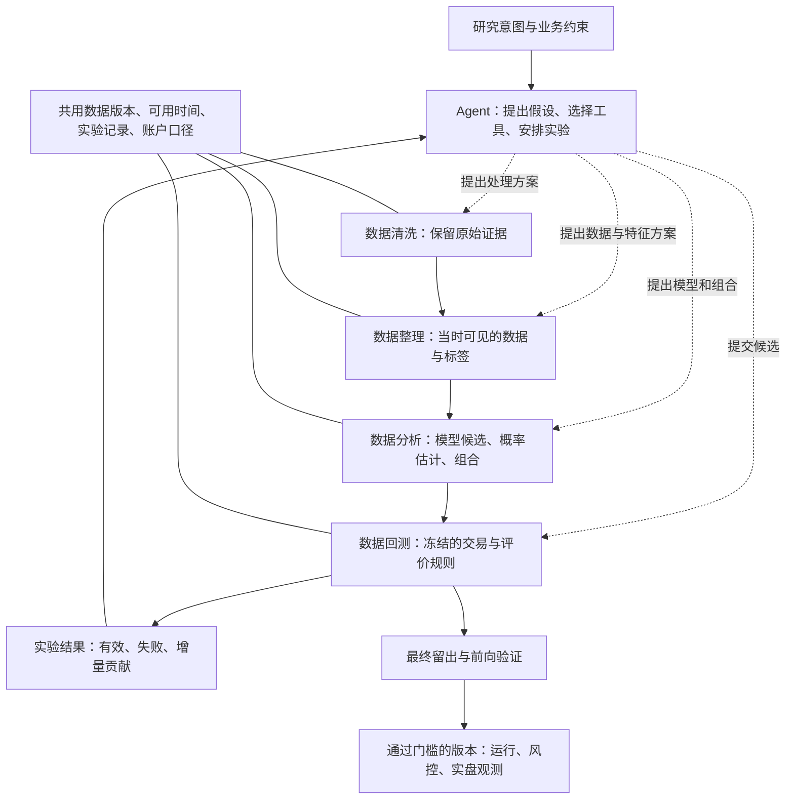

# 金融机器学习组合体系：可行性、论文证据与架构讨论

研究日期：2026-09-17。状态：Deep Thinking 研究稿，尚未采用为实施方案。

本稿回应用户把研究扩展到整体机器学习的明确要求，按数据清洗、数据整理、数据分析、数据回测四类组织。检索覆盖 2023-01-01 至研究日的相关工作；少数 2022 年预印本、2023 年正式发表论文单独注明。重点是投研与交易，不把金融行业所有信用、保险和反欺诈任务都并入本期产品。

方法：论文索引多主题检索、相关论文扩展、原文关键章节核对，辅以出版机构和作者官方仓库。下文整理 22 篇重点文献，属于有边界的代表性研究，不声称穷尽全部论文。关键结论标明适用任务及证据限制；未安装、运行或复现论文结果。

**总体判断：构建可组合的机器学习研究体系可行，值得推进。收益能力必须由市场数据与执行验证决定。** Agent 可以降低阅读、实现、调参、实验编排和失败分析成本，让多个工具真正协作。系统的可靠性主要来自正确的数据时间、可重复的数值计算、完整的实验记录与可信的回测，而不是来自某个神经网络的名称。

用户希望扩大方法与组合空间，这个方向保留。架构建议采用可以替换、单独检验、按证据组合的研究流程图。是否把部分模型联合训练，是某项实验的选择，不必把所有模块合成一张巨大的端到端网络。

**先纠正三处容易混淆的前提。**

第一，LSTM、GAN、监督学习、强化学习不是同一个分类维度。LSTM 是序列编码骨干；GAN 是对抗式训练及生成建模框架，内部可以使用 LSTM、卷积或 Transformer；监督学习和 RL 规定如何从标签或行动反馈学习。一个模型可以同时采用 LSTM、GAN 和监督目标。“LSTM + GAN”有合理技术含义，但不能仅凭组合名称推断优于其他方法。

第二，“Transformer 普遍不适合金融去噪”不是目前证据支持的共识。AAAI 2023 的 DLinear 论文质疑当时部分长期时序预测 Transformer，在九个数据集上展示简单线性模型的竞争力；其任务和结论范围不能扩展成整个金融领域的去噪禁令。PatchTST、金融专用 MASTER，以及 LSTM + PatchTST 的金融结果提供不同方向的证据。[DLinear](https://ojs.aaai.org/index.php/AAAI/article/download/26317/26089)、[PatchTST](https://arxiv.org/abs/2211.14730)、[MASTER](https://arxiv.org/abs/2312.15235)、[金融风险收益基准](https://arxiv.org/html/2603.01820v1)。

还需区分三种“去噪”：数据错误修复、从市场观测中提取任务相关表征、扩散模型学习逆转人工加噪过程。TRADES 使用 Transformer 进行扩散去噪并生成订单流，说明该结构可以承担金融生成任务；这不证明它能从真实价格中找出一个可观测的“无噪声真价格”，也不证明用它清洗数据能提高收益。[TRADES](https://arxiv.org/html/2502.07071v3)。

第三，LLM 不应成为不可绕过的可靠性基础，但数值神经网络同样不能独自承担这种责任。LSTM 也会漂移，GAN 也会遗漏尾部，风险预测也会失准。适合用确定性程序固定的是时间可用性、单位和实体映射、订单与账户规则、约束和评价口径；模型负责带不确定性的估计。

**四组最能改变决策的证据。**

| 证据 | 可以支持什么 | 不能推出什么 |
|---|---|---|
| Fin-GAN，Quantitative Finance 2024 | 将循环网络与 GAN、经济目标结合，输出条件收益分布；论文比较 LSTM、LSTM-Fin、ARIMA 等，并报告股票/ETF 实验 | 没有由此证明本项目资产上的净 Alpha；经济损失函数改变了分布学习目标，需要另测概率校准；本轮未完成其全部执行成本审计 |
| 2026 年日频期货风险收益基准 | VSN + LSTM、VSN + xLSTM、LSTM + PatchTST 在不同收益/下行风险指标上有竞争力，值得检验混合结构 | 主训练与主表设交易费为零，另做盈亏平衡成本分析；代码须向作者索取。不能称已复现的成本后实盘结论 |
| 2026 年 918 次多周期价格预测比较 | ModernTCN、PatchTST 在该设置的价格误差指标上领先，显示卷积和注意力都应保留 | 作者同时报告平均方向准确率约 50.08%，不评价交易盈利。不能将误差榜直接转换为交易选型榜；也不能据该设置否定所有 LSTM |
| 2023 年条件 LOB 生成器研究 | 模拟器可以在静态统计上像市场，却让简单策略或针对性动作获得不真实的利润 | 在 GAN 世界中训练好的 RL 不自动具有现实市场收益；换成扩散模型也不自动解决交互有效性 |

来源：[Fin-GAN](https://www.tandfonline.com/doi/full/10.1080/14697688.2023.2299466)、[期货基准正文](https://arxiv.org/html/2603.01820v1)、[918 次实验正文](https://arxiv.org/html/2603.16886v1)、[Conditional Generators](https://arxiv.org/html/2306.12806)。以上研究的不同排名并不矛盾：资产、预测对象、周期、模型适配和优化目标不同。

**四个环节如何组织。**

| 环节 | 必须可靠的工作 | 可引入的学习方法 | Agent 的合适职责 | 可验收产物 |
|---|---|---|---|---|
| 数据清洗 | 来源核对、去重、乱序处理、缺口与过期状态、单位一致、原始数据保留 | 异常检测；受限缺失插补；因果滤波；有明确目标的去噪表征 | 提出异常原因、寻找来源、生成并测试清洗规则 | 原始/处理值对照、质量报告、修复原因、可用时间 |
| 数据整理 | 实体/合约对齐、按当时可得信息连接数据、标签与窗口定义、时间分割 | 自监督表征、聚类、图关系提取、文本事件抽取 | 把研究意图变成字段和任务定义，查资料、提出特征/算子 | 带版本的数据集、特征定义、标签定义、关系和来源 |
| 数据分析 | 同预算基线、任务目标、概率校准、组合与风险约束 | 树、MLP、RNN、CNN、注意力、图、状态空间、生成模型、元学习、RL | 提假设、选实验、实现候选、分析反例、分配研究预算 | 冻结模型、样本外预测、置信信息、消融与增量贡献 |
| 数据回测 | 时间推进、订单成交、账户计算、费用和资金占用、分割与留出规则 | 经校准的成交/冲击估计；条件生成情景；策略学习环境 | 调用冻结回测器、解释失败、提出下一轮可证伪问题 | 净值、成交与订单轨迹、净成本、风险、容量和压力报告 |

四类是研究产品的主流程。实际交易、资金风控和运行监控承接其结果，属于部署运行职责；不能因为研究界面分四类，就省略订单、资金和异常处理。

图中 Agent 选择的是工具及实验流程，不等于所有选择都要训练成神经网络。意图识别初期可以由现成 LLM 输出结构化任务，再由程序检查资产、周期、输入、目标和限制。资金分配若使用动态门控，则该门控本身就是策略，需要单独评价。

**研究目录建议覆盖十组方法，而不是预定十张网络必须全部上线。** 这是方便工程研究的分组，不是互斥的学术分类；例如 Transformer 可以作为 GAN 的骨干，元学习也可以更新 LSTM。

| 方法组 | 主要用途 | 进入本项目的理由与边界 |
|---|---|---|
| 统计模型、线性模型、树模型 | 基线、表格特征、波动与风险估计 | 必须保留 naive/线性、LightGBM 或 CatBoost 等强基线。不是深度学习，但能揭示复杂模型是否有增量；FinTSB 与 TSFM 金融研究都表明不能轻视树模型 |
| RNN：LSTM、GRU、xLSTM | 序列状态、条件收益分布、连续控制表征 | 有金融实证与混合结构依据；主要检查遗忘、漂移、训练目标和换手，不因结构较早就排除 |
| CNN/TCN | 局部订单簿形态、多尺度时间模式 | 可以作为较快的时序候选；需用交易目标复核价格误差优势 |
| MLP/Mixer | 指标、时间、横截面的信息混合 | StockMixer 提供金融专用的轻量结构，不必先堆复杂模块 |
| Attention/Transformer/时序基础模型 | 跨变量关系、不同时间尺度、预训练迁移 | 保留 PatchTST/MASTER 等对照。通用预训练与金融领域预训练应分开；预训练语料是否包含评测期必须核验 |
| GNN/关系模型 | 资产、行业、事件、钱包或合约之间的关联 | THGNN 等支持动态关系研究；价格相关不等于经济因果，更不等于合约支付逻辑 |
| 状态空间模型：S5/Mamba 等 | 长事件流和序列压缩、订单流生成 | S5 订单流与 LOB-Bench 提供金融方向证据；Mamba 不是天然胜者，只有长序列资源或效果确有优势才升优先级 |
| 生成与潜变量模型：GAN、VAE、Diffusion、Flow | 条件分布、合成样本、缺失估计、尾部/流动性情景 | 四种不同生成机制，按用途选择。最有价值的初始位置可能是概率预测与压力测试，而非声称合成了新 Alpha |
| 元学习、在线适应、集成与门控 | 处理状态切换、组合互补专家 | DoubleAdapt 提供可检验起点；必须使用当时已揭晓的反馈，避免用未来结果判断当前“应该选哪个专家” |
| 符号搜索与 RL | 因子表达式、分配研究预算、多步仓位/执行控制 | AlphaGen 的因子搜索和交易账户 RL 是不同任务；只有行动会改变未来状态时，才有必要额外引入相应决策复杂度 |

概率预测、校准、风险优化和自监督训练横跨上述方法，不宜再当成互斥模型族。Conformal 方法可以校准不确定性，但其覆盖保证有数据假设，不能当成非平稳市场中的保本承诺。[金融 TSFM 研究](https://arxiv.org/abs/2511.18578)、[Conformal 与优化](https://arxiv.org/html/2409.20534)。

对第一轮架构判断，建议用六个对照入口：简单线性/naive、一个树模型、LSTM/GRU、TCN、StockMixer、PatchTST 或 MASTER。先让它们使用同一任务和评价口径，再选一个生成式候选回答具体问题。这是实验规模建议，不是完整产品范围，也不替代原先 SFT/RL 能力的交付讨论；更不表示必须等这六个都跑完才能继续现有已授权工作。

**五种值得研究的组合，分别对应不同价值。**

| 组合 | 为什么可能有用 | 必须做的对照 |
|---|---|---|
| 事件/条款抽取 + 树模型或序列模型 + 概率校准 | LLM 将非结构化信息转成带来源、可计时的事件特征，数值模型学习强度与时效 | 数值数据独立基线；加入真实当时文本后的增量；延迟一档/移除文本后是否仍成立 |
| LSTM 编码器 + 条件 GAN + 受约束的组合优化 | 输出收益分布而非一个价格点，使收益与不确定性一起影响决策 | 同骨干、同预算的非 GAN 分位数模型；检查校准、尾部、成本与模式覆盖 |
| TCN 局部专家 + 关系模型 + 简单集成 | 结合订单流局部形态与跨资产传播，探索误差互补 | 每个专家单独表现、等权组合、逐项移除；联合压力下相关性和换手 |
| 条件扩散/状态空间生成器 + 固定策略或 RL 压力试验 | 扩大流动性、波动和冲击情景，找到策略脆弱点 | 历史真实数据、简单统计情景和生成情景分别报告；检验长期滚动偏离与策略利用模拟器缺陷 |
| 符号因子搜索 + 多模型预测 + 在线适应 | 自动寻找可解释表达式，同时让不同模型学习非线性和状态差异 | 固定因子/固定模型/固定权重三种基线；整个选择流程的滚动样本外结果 |

组合的成功条件是新增信息、互补误差、不同时间尺度或更适合的决策目标，不能只看模块数量。两个不同网络若都依赖同一段趋势，遇到反转仍可能同时失效。生成同一批历史数据的更多样本，也不等于获得更多独立的市场历史。

**问题与挑战：最大的瓶颈很可能从模型实现转向实验可信度。**

1. **研究自由度会吞掉样本。** 清洗、窗口、标签、资产池、模型、随机种子、损失、组合和执行阈值都参与搜索。即使每次模型训练使用时间分割，只要 Agent 一直查看同一段“测试”表现并改方案，该段数据也逐渐成为调参数据。候选之间相关，因此有效试验数不等于简单笛卡尔积，但选择偏差不会自动消失。
2. **“去噪”可能删除信号。** 价格跳跃可能来自坏数据，也可能是真实清算、流动性撤走或信息到达。离线的双边滤波、全样本缩放、整段小波/EMD 分解还可能引入未来信息。按训练段拟合、滚动变换、保留原始通道和缺失标记，再测最终决策增量。
3. **目标未必对齐。** 最小化价格 MSE、提高方向准确率、提高 IC、优化收益风险、改善成交质量是不同任务。概率和持仓之间还隔着成本、资金占用和约束。直接优化 Sharpe 也可能过拟合少数极端区间。
4. **生成模型不能凭空恢复未知风险。** GAN 模式崩塌、扩散/状态空间长轨迹偏离、尾部联合依赖错误都可能制造乐观环境。测试策略在模拟器里的经济表现，还需参考真实成交和独立的压力情景。
5. **非平稳让组合器也成为风险来源。** 最近表现最好可能只是噪声；过快切换引入换手，过慢切换错过结构变化。在线学习还受标签延迟约束，不能在尚未到期的收益上更新模型。
6. **数据可得性与运行成本限制可移植性。** 日频股票结果不自动适用于分钟永续或预测市场；完整深度、下单状态、合约规则、资金费与可执行报价常常比换一个骨干更重要。论文代码与数据是否能取得、环境能否复现，应与效果一起筛选。

对第 1 点，建议评价完整流程：研究内部滚动验证；选择器/组合器在外层时间段验证；最终留出按计划开启；前向实盘单独记录。额外用零预测能力的合成环境和针对时序/微观结构的安慰剂检查是否仍会“发现 Alpha”。这类方法已有 2026 年论文支持，但该论文是预印本，不能当成已统一的行业标准。[Spurious Predictability in Financial Machine Learning](https://arxiv.org/html/2604.15531)。

**值得抓住的机遇。**

- **文本理解与数值工具之间的转换。** Agent 读论文、规则和公告，把研究意图转成有来源的字段、表达式、事件关系和实验。这比要求 LLM 在长数字序列上直接预测有更明确的分工，也保留了学习型 Agent 策略作为可测候选的空间。
- **跨方法的互补。** 条件收益分布、成交概率、流动性、风险状态和资产关系是不同预测对象。改善交易过滤、规模控制或执行成本，也可能产生经济价值，不必所有模型都预测下一根价格。
- **复用表征与失败证据。** 同一份有时间约束的数据和特征可以服务多个任务；Agent 保留失败条件和重复实验结果，可以少走重复路径。是否实际提高效率，要比较相同算力、API 和人工预算下得到多少可复现候选。
- **更有解释力的产品。** 工作台可以直接呈现“数据是否可信—为什么试这个组合—相对基线增加了什么—压力下会怎样—实盘与回测差在哪里”，同时保留完整账户/操作能力。这种可追溯性与良好 UI 相互支持，不靠复杂网络图制造成熟感。

R&D-Agent-Quant 已研究因子与模型联合优化，说明这种 Agent 编排方向有现成路径；它也意味着“LLM + 多模型”本身不足以形成差异化。差异更可能来自具体市场的数据与机制、执行质量、可靠评价以及研究到部署的连续性。[论文](https://arxiv.org/html/2505.15155v2)、[官方代码](https://github.com/microsoft/RD-Agent)。

**当前想法中最需要补齐的盲区。**

| 盲区 | 对架构的影响 |
|---|---|
| 意图识别与资金选择混在一起 | “用户想研究什么”可由 LLM 解析；“此刻如何分配资金”是策略，必须经过外层样本外检验。不能因为选择器善于解释，就认为它善于择时 |
| 假设存在可识别的“干净金融信号” | 没有通用的噪声真值。先定义要保留的风险、事件、时间尺度与下游目标，再讨论清洗方法 |
| 把生成分布直接当可信概率 | 经济目标可能故意倾斜生成分布；样本看起来真实不等于概率校准。区间覆盖和尾部误差必须另测 |
| 只防数据表泄漏，没防 Agent/基础模型记忆泄漏 | 新闻、后来的论文、实验总结及预训练语料可能包含当时未知的结果。历史测试中限制可查资料，最终证据包含真正前向记录 |
| 将模型多样性当成 Alpha 多样性 | 要看成本后残差收益、共同暴露和压力期相关性，不以架构名称计数 |
| 将监督学习/RL/预测基础模型混为“更新权重” | 研究记忆改进、权重训练、在线参数更新和资金权重变化要分别记录，否则无法归因哪个环节带来收益 |
| 忽略“知道但不交易”的价值 | 模型发现不确定性大、深度不足或数据过期时，应能不给信号；拒绝交易的效果需要纳入评价 |
| 用 15–20 天代表长期稳健性 | 这些天数提供真实运行和短期经济证据，但市场状态有限，不能证明跨周期收益；既要保留窗口，也要报告统计不确定性 |

关于双向 LSTM 还需精确：它读取一个完全处于决策时点之前的历史窗口，本身不必泄漏；若插补或生成当前特征时读取决策之后的观测，则泄漏。判断标准是实际可用信息，不是模型名称。

**复用路径与取舍。**

当前证据支持先考察 Qlib 的数据、实验和模型入口，借鉴 FinTSB 的统一比较设计，以及 RD-Agent 的研究循环。它们的适用层不同，不需要把三个完整平台拼成一个平台。具体市场的执行和账户规则继续使用既有候选执行引擎；是否更换此前候选需单独基于接口与运行证据讨论。[Qlib 官方库](https://github.com/microsoft/qlib)、[FinTSB 官方库](https://github.com/TongjiFinLab/FinTSB)。

本轮核对发现 FinTSB 官方 README 仍提示预处理材料待开放，数据来自外部渠道；它有代码并不等于本项目数据一键可用。Fin-GAN 与 FinTSB 仓库显示 GPL-3.0，商业集成前应按实际复制、修改和分发方式核对许可条件，不将其误写成可无条件复制的胶水组件。此处只是识别集成条件，未作法律适用结论。[Fin-GAN 代码](https://github.com/milenavuletic/Fin-GAN)、[FinTSB 代码与准备说明](https://github.com/TongjiFinLab/FinTSB)。

三个可比较的架构选择：以单一巨型联合网络为中心，表达力高但归因和迭代耦合重；以大量独立模型为中心，容易复用但缺少统一反馈；以统一数据/评价下的可组合研究流程为中心，可分别验证模块、组合和 Agent。当前推荐第三种，因为它同时满足广泛研究和成熟工具复用。若今后出现清晰任务与充分数据，局部联合训练仍可作为其中一个候选。

**如何与 10 月交付约束共存。**

用户要求仍是 10 月 15 日前具备完备前后端和良好 UI，并为训练后的策略保留约 20 天、最低 15 天真实实盘。本轮未核验当前实施进度，不能把 9 月 14 日当成尚未开始的未来起点。

沿用此前“10 月 13 日 00:00 结束观测，13–14 日整理交付”的安排假设，20 天要求 9 月 23 日 00:00 启动，15 天要求 9 月 28 日 00:00 启动。从 9 月 17 日按日期计算约剩 6 天或 11 天。该边界取决于实际满 24 小时运行区间；运行探针、影子交易和不同模型的天数不能相互替代。

因此广泛文献研究可以扩展候选库，但不能把“搭完所有模型之后再开始训练与实盘”设为串行依赖。需要尽早冻结满足既定经济与运行门槛的候选及数据接口，让其积累自己的实盘证据；其他算法使用相同接口继续研究，产品前后端同步完善。若当前数据、账户或训练进度已经使日期不可达，应明确报告实际缺口，再讨论取舍，不能悄悄压缩实盘或降低交付能力。

这也不意味着已经选定一个市场或某个模型。下一轮落地讨论最有价值的输入是：基金真正关注的首个投资决策是什么、何时决策、能拿到哪些当时可见数据、能怎样成交，以及当前实现到哪一步。先确认这些，论文才能转成有边界的实验。

**重点论文清单与阅读深度。**

“正文”表示核对与本稿判断相关的方法/实验/限制段落，并非逐行复现；“候选”表示核对摘要、正式论文入口或官方实现，暂不据此给出细粒度绩效承诺。作者报告实盘或部署的地方，也不等于本轮独立验证。

| # | 文献与时间 | 阅读深度 | 本项目用途与关键边界 |
|---|---|---|---|
| 1 | [SAITS: Self-Attention-based Imputation for Time Series，2023 期刊；2022 预印本](https://github.com/WenjieDu/SAITS) | 候选：官方实现与发表信息 | 清洗/插补方法；通用时序证据，金融因果时间与交易增益需另验 |
| 2 | [Are Transformers Effective for Time Series Forecasting?，AAAI 2023；2022 预印本](https://ojs.aaai.org/index.php/AAAI/article/download/26317/26089) | 正式论文核心论证 | 简单线性基线、公平预测形式；不是金融去噪的普遍否定结论 |
| 3 | [A Time Series Is Worth 64 Words / PatchTST，ICLR 2023；2022 预印本](https://arxiv.org/abs/2211.14730) | 候选 | patch 与通道独立的时序注意力；通用预测结果需金融复核 |
| 4 | [Temporal and Heterogeneous GNN for Financial Time Series Prediction，2023](https://arxiv.org/abs/2305.08740) | 候选 | 动态资产关系与时间编码；未独立核实作者的部署表现 |
| 5 | [DoubleAdapt，KDD 2023](https://arxiv.org/abs/2306.09862) | 正文 | 数据与模型双适配；在线标签延迟和状态切换需按业务实现 |
| 6 | [Generating Synergistic Formulaic Alpha Collections via RL / AlphaGen，2023](https://arxiv.org/abs/2306.12964) | 候选 | 优化因子集合的协同价值；不等于账户交易 RL |
| 7 | [Conditional Generators for LOB Environments，2023](https://arxiv.org/abs/2306.12806) | 正文 | 生成式环境交互脆弱性；应作为生成器/RL 路线的必读反证 |
| 8 | [Generative AI for End-to-End LOB Modelling，2023](https://arxiv.org/abs/2309.00638) | 候选；与 LOB-Bench 交叉核对 | S5 消息流生成接确定性订单簿；生成能力与交易盈利分开 |
| 9 | [MASTER，AAAI 2024；2023 预印本](https://arxiv.org/abs/2312.15235) | 候选：论文与官方库 | 市场引导特征选择、跨时间/跨股票注意力；不能直接映射为合约逻辑 |
| 10 | [StockMixer，AAAI 2024](https://ojs.aaai.org/index.php/AAAI/article/download/28681/29322) | 正式论文核心方法 | 轻量指标/时间/股票混合；适合复杂组合的低成本对照 |
| 11 | [Fin-GAN，Quantitative Finance 2024](https://www.tandfonline.com/doi/full/10.1080/14697688.2023.2299466) | 正文与官方库 | 条件收益分布、经济损失；复现依赖数据与成本设定 |
| 12 | [End-to-End Conformal Calibration for Optimization Under Uncertainty，2024 预印本](https://arxiv.org/abs/2409.20534) | 正文 | 不确定性与组合优化；分布变化下交换性和覆盖保证可能失效 |
| 13 | [FinTSB，2025 预印本；2026 期刊/修订](https://arxiv.org/abs/2502.18834) | 正文与官方库 | 多类模型、排名/误差/组合评价；股票设置和预处理数据条件须复核 |
| 14 | [TRADES，2025](https://arxiv.org/abs/2502.07071) | 正文，v3 | Transformer 扩散订单流；两只股票上的仿真结果，不是通用市场生成证明 |
| 15 | [LOB-Bench，2025](https://arxiv.org/abs/2502.09172) | 正文 | 条件分布、影响响应、长轨迹偏离；两只股票与 LOBSTER 格式边界 |
| 16 | [CTBench，2025](https://arxiv.org/abs/2508.02758) | 正文 | 加密资产生成、预测和统计套利比较；默认零费，另有套利费率场景，不能统一称净收益榜 |
| 17 | [R&D-Agent-Quant，2025](https://arxiv.org/abs/2505.15155) | 正文与官方库 | Agent 共同优化因子与模型；自动化研究有先例，可靠实盘仍需独立建设 |
| 18 | [Re(Visiting) Time Series Foundation Models in Finance，2025](https://arxiv.org/abs/2511.18578) | 正文 | 通用零样本/微调较弱，金融预训练相对改善；强树基线仍有竞争力，所述投资组合结果不计成本 |
| 19 | [Deep Learning for Financial Time Series: A Large-Scale Benchmark of Risk-Adjusted Performance，2026 预印本](https://arxiv.org/abs/2603.01820) | 正文 | 日频期货、LSTM 混合、风险与成本缓冲；主评估毛收益、代码需索取 |
| 20 | [A Controlled Comparison…918 Experiments，2026 预印本](https://arxiv.org/abs/2603.16886) | 正文 | CNN/Transformer 的价格预测比较；方向接近随机，无交易盈利检验 |
| 21 | [Spurious Predictability in Financial Machine Learning，2026 预印本](https://arxiv.org/abs/2604.15531) | 正文 | 对整个自适应研究流程做零预测能力反证；新方法候选，不宣称标准已统一 |
| 22 | [TradeFM，2026 预印本](https://arxiv.org/abs/2602.23784) | 候选 | 大规模交易事件基础模型连接确定性模拟器；规模与数据需求高，分布相似度不等于 Alpha |

未把检索中出现但未取得足够原文的 FINGAN-BiLSTM 等条目当成主要结论；LSTM/GAN 的判断主要采用可核对的 Fin-GAN。TimeGAN、QuantGAN、传统 GARCH 等虽早于范围，仍可作基础方法或对照，但不伪装成 2023 年后的新成果。

**本轮建议的下一步讨论顺序。** 先选定一个具体投资决策及其数据/执行条件；然后固定四类流程的输入输出和评价规则；再确定第一批有机制理由的候选与组合；最后对照真实实施进度排入交付窗口。若组合在未见数据上没有超过强基线，仍保留研究体系的复用价值，但不能把研究自动化的成功报告为策略 Alpha 的成功。
