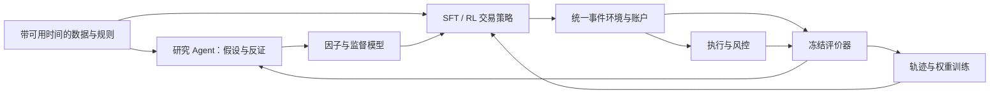

# 因子、SFT 与 Agent RL：面向基金合作的三阶段落地方案

初始调研：2026-09-12；修订：2026-09-13。方案版本：讨论稿 v2。业务澄清：用户所说 WA 指 RWA 套利机会。

本报告回答如何用现成基础设施，串联研究、机会发现、训练、仿真、执行和反馈。当前完成的是文献、源码和部分公开接口核验；未安装交易系统、复现论文收益、训练模型或开展交易。上级目录的旧方案作为历史材料保留，本方案采用用户本轮明确提出的因子、主观研究、SFT 与 RL 结合方向。

**建议：一条业务主线，一套事件与账户环境，三组递进对照。** 研究 Agent 负责提出和修正假设；因子与监督模型提取有用信息；SFT 教会 Agent 正确使用工具和处理交易任务；RL 按连续决策产生的账户结果优化策略。执行与风险约束复用成熟引擎。首期既做真正的模型权重训练，也保留简单策略，靠公平实验判断复杂方法是否值得。

**当前明确交付要求：10 月 15 日之前，完成可用的后端、前端与具有审美品质的基金工作台，并为训练后策略保留约 20 天、至少 15 天实际实盘。** 本计划按 10 月 14 日结束前交付，预留 10 月 13–14 日做证据整理与交接。目标 9 月 23 日开始实盘；15 天方案最晚 9 月 28 日开始。影子运行不能替代这些天数。

按 9 月 14 日开始实施，20 天方案只剩 9 个日历日完成首个候选的集成、训练和上线演练；15 天方案有 14 个日历日。20 天是积极目标，15 天是当前可用的最迟上线边界，均依赖第一批数据、账户和算力及时到位，不能提前保证。原来的四周/两名工程人员是助手假设，已被本次倒排取代。建议前端产品、后端执行、数据训练三条产能并行；人员/GPU、资金和风险阈值仍待落实。

完整产品、真实训练、实际实盘天数分别验收。15–20 天能提供真实执行、运行稳定性与短期策略表现的证据，不能自动证明长期盈利或大资金容量。本轮仍是完善方案及 Claude Code 审阅，不进行部署、采购或交易。

**先统一三种学习的分工。** 因子是信息的表达，例如资金费率偏离、可成交组合价差、申赎价差、订单失衡；它可以人工定义、监督学习得到，也可以用 RL 搜索。SFT 特指对模型进行监督微调，并不等于因子本身。我们的组合应是：

| 方法 | 本项目具体学什么 | 如何知道学到了 |
|---|---|---|
| 因子与普通监督学习 | 从当时可得数据估计价格变化、成交概率、事件概率、赎回耗时等 | 时间外预测表现、校准误差，以及加入策略后的净增益 |
| Agent SFT | 理解合约条件、选用工具、验证假设、生成合法动作、识别无机会情形 | 留出任务中的工具与决策正确性；与相同基础模型比较 |
| 交易 Agent RL | 查什么、何时交易或等待、规模、退出、对冲及跨机会分配资金 | 完整多步 episode 的成本后账户结果；与 SFT-only 比较 |
| 研究循环 | 下一轮试什么、组合什么、停止什么 | 相同研究预算下，冻结后的策略在未见数据上改善多少 |

RL 仍需要人定义经济目标、期限和约束。它的优势是直接学习行动及其后果，允许产生人没有逐条标注的策略；不是取消人的目标定义。主观研究进入假设、先验和示范，随后接受同一套反证与回测。

**文献支持组合路线，但没有一篇可直接充当完整产品。** 下表以论文解决的问题、源码开放程度为准，不按论文中的最高收益排名。源码存在不等于本轮已运行。

| 研究或项目 | 实际提供的能力 | 本项目取舍 |
|---|---|---|
| [AQuA，2026-08](https://arxiv.org/html/2608.12841v2) | 假设、实验、评价、记忆形成自改进研究循环；符号因子与监督模型是独立系统，不更新底层 LLM 权重；关键实现有未披露部分 | 借鉴研究记录与失败反馈，不将论文视为完整开源底座，也不把记忆更新称为参数 RL |
| [AutoScientist-Quant，2026-09 版本](https://arxiv.org/html/2608.28632v2) | 由受预算约束的控制器选择改进、组合、转向或停止研究 | 借鉴跨实验的预算分配；本轮未核实可直接交付的官方完整代码 |
| [RD-Agent](https://github.com/microsoft/RD-Agent) | 有实际量化研究、因子与模型迭代代码 | 参考其研究实验入口和结果结构；不连同整个框架重新搭平台 |
| [AlphaGen](https://github.com/ICT-FinD-Lab/alphagen) | RL 搜索能够协同工作的因子表达式 | 因子不必放弃；发现因子的 RL 与管理账户的 RL 分开评价 |
| [AlphaPROBE](https://github.com/gta0804/AlphaPROBE) | 贝叶斯检索、因子依赖与搜索，仓库有训练脚本 | 参考搜索方法；所查版本未找到许可证，商业项目引入代码前需解决授权 |
| [AlphaQuanter，ACL Findings 2026](https://aclanthology.org/2026.findings-acl.456/) | 有工具轨迹与 GRPO 训练；[奖励源码](https://github.com/horizon-llm/AlphaQuanter/blob/fac423cb1b45a3d0593e88a0f9805c338d7e0fea/verl/recipe/langgraph_agent/stock_trading/my_reward_fn.py)按未来收益阈值评买卖持有，并叠加格式和工具奖励 | 参考金融工具使用训练；我们的奖励需要改为连续账户结果，不能直接照搬分类代理 |
| [FLAG-Trader，ACL Findings 2025](https://aclanthology.org/2025.findings-acl.716.pdf) | 将 LLM 作为交易策略的一部分，以 PPO 和投资组合结果学习 | 参考直接交易 RL 的训练对象；论文简化环境的结果不能外推到链上执行 |
| [Trading-R1](https://arxiv.org/abs/2509.11420) | SFT 后再进行分阶段 RL，组织分析、证据与决策 | 支持组合训练思路；本轮查到的[仓库](https://github.com/TauricResearch/Trading-R1)仍是发布预告，不能列为可用训练框架 |
| [FinWorld](https://github.com/DVampire/FinWorld) | 多类金融任务、数据、RL 与 Agent 研究组件，有实际训练配置和脚本 | 可作样例与对照；不与另一套仿真引擎和训练框架整体合并 |
| [F2Agent，2026-08](https://arxiv.org/abs/2608.05668) | 多模态分析、动态融合及抗噪声设计 | 参考不同信息来源的融合；Agent 名称本身不能证明是交易 RL |
| [Agent Lightning v1.0](https://github.com/microsoft/agent-lightning) | 将实际 Agent 工具循环中的模型轨迹接入训练，现有例子使用 verl/GRPO | 作为 Agent RL 的首选集成候选；采用 v1 接口，不混用旧教程 |
| [FINSABER](https://arxiv.org/abs/2505.07078) / [代码](https://github.com/waylonli/FINSABER) | 用更长时间、更多标的检验金融 LLM 策略，揭示短样本结论不稳健 | 借鉴评价方法，不因此预先判定所有 Agent RL 无效 |
| [PolyBench](https://github.com/PolyBench/PolyBench) | 预测市场事件、快照和预测评价材料 | 作为候选数据和任务来源；不能代替连续订单簿或反事实成交环境 |

由这些证据可以支持的判断是：研究自动化、因子搜索、SFT、工具 Agent RL、组合控制都有可复用部分。尚未核实有一个现成开源系统，完整解决 Polymarket/RWA 的数据时间一致性、可成交仿真、训练、资金管理和前向验证。我们需要补的是这些接缝。

**首期业务怎么选。** 同时做两个业务的数据与交易路径核验，限定前三天；正式训练与执行只选一个主线。方法对照放在同一主线上，避免把市场不同误认成算法差异。

| 候选业务 | 可验证的起点 | Agent/SFT/RL 的实际用途 | 选择条件 |
|---|---|---|---|
| Polymarket 相关事件组合 | 先验证完整集和明确逻辑约束，再研究信息变化后的组合价值 | 从条款中找关系；决定补查什么；在部分成交、资金占用和机会变化下交易或放弃 | 有可用历史快照/订单簿、足够事件样本；基金可用交易账户 |
| RWA 可兑现价差 | DEX 可成交报价，对照基金实际可执行的一级申购/赎回或其他退出路径 | 解释不同产品条件；估计等待与成本；选择规模、时机和可用对冲 | 基金已有资格、报价、费用与容量信息；可落实完整资金流 |

默认建议先做 Polymarket 相关事件组合。如果基金已有 RWA 一级渠道、稳定报价和业务经验，RWA 可能更值得优先，因为这种渠道本身可能构成比公共数据模型更强的优势。该选择不是预先认定哪边更赚钱。

Polymarket 的第一条确定性基线可以非常简单：相同到期时点、相同价格来源，设 A 为价格大于 100，B 为价格大于 110，则 B 蕴含 A。在这两个合约均按对应二元事件结算的条件下，买 A 的 YES 和 B 的 NO，总到期支付至少为 1。只有可成交买价、费用和其他成本合计低于该下界，且交易腿能按假设完成，才存在可执行候选。先让确定性代码验证逻辑与支付，再让 Agent 发现候选和管理执行；不让 RL 重新学习这个算术恒等式。

逻辑与组合套利已有[实证研究](https://arxiv.org/abs/2508.03474)，不是无人涉足的新市场。潜在增益在于正确读懂新合约、迅速排除伪关系、考虑可用深度、资金占用和未完成的交易腿。原生 [Combos/RFQ](https://docs.polymarket.com/trading/combos/overview)也已存在，应单独评估其报价和产品定义；它不等于任意一篮子 CLOB 订单都原子成交，首期不假定已有适配器覆盖它。

RWA 首先写出完整支付路径，例如“二级买入 → 满足持有与转让条件 → 发起可用赎回 → 收款/换回基准币”。NAV 偏离只能提出研究问题。需要计入真实可得赎回报价、额度、等待、融资、对冲及失败情形。以 [OUSG](https://docs.ondo.finance/qualified-access-products/ousg/redeeming)为例，即时与非即时赎回条件不同，不能统一设成无条件即时到账。跨 RWA 与永续合约的价差，若没有一致的可兑现支付关系，应称相对价值策略，不能包装为无风险套利。

Hyperliquid 保留为后续控制基准、数据更完整的候选环境或所选业务确实需要的对冲渠道；首月不同时交付三个生产适配器。若两个首选业务都缺少关键数据或渠道，应将缺口提交业务选择，而不是悄悄换市场并声称完成原业务。

**交易核心保留七个职责，完整产品增加前端和业务 API。** 用一个项目、共用业务对象、隔离的训练与交易运行环境连接，不按每层拆成服务。云端共享操作状态用 PostgreSQL，研究数据与模型文件用 Parquet/对象存储；本地 SQLite 可以保留为研究缓存，不同时充当另一套生产状态。

| 层 | 负责什么 | 复用什么 | 必须补的连接 |
|---|---|---|---|
| 数据 | 行情、链事件、条款、新闻、申赎报价统一到当时可见状态 | 官方接口、Parquet/对象存储、PostgreSQL 操作与实验记录 | 标的映射、单位、可用时间、去重与缺口标记 |
| 研究 | 提假设、查反证、运行有预算的实验、提出下一轮 | 现成工具调用模型；借鉴 AQuA/RD-Agent 的实验循环 | 固定工具集与实验入口，保存失败原因，禁止读取最终留出集 |
| 表征 | 计算因子、预测与校准值；保留有必要的原始状态 | pandas/NumPy；现有监督学习库 | 同一特征函数用于历史与实时，不另写第二份公式 |
| 策略训练 | SFT、数值 RL 基线、LLM Agent RL | TRL/PEFT；SB3 PPO；Agent Lightning v1 + verl | 训练样本、rollout 函数、可核对的奖励与轨迹导出 |
| 仿真 | 事件推进、订单状态、余额、持仓、成交、结算 | Nautilus BacktestEngine | 分段推进包装、所选业务缺失的支付/申赎事件处理 |
| 执行 | 将同一策略动作变成订单，限额、撤单、恢复与核对 | Nautilus 现有适配器或未覆盖产品的官方 SDK | 最小动作桥接与必要的市场特性处理 |
| 评价反馈 | 经济结果、故障归因、模型比较、下一轮研究素材 | 现有统计工具与实验产物 | 一个评价函数、一份实验清单，研究 Agent 无权改本轮评价口径 |

训练环境与交易环境分开锁依赖，通过数据、轨迹和模型文件交接；避免强迫 Torch/verl 和交易引擎共享一套依赖。首期不引入多微服务、消息总线、复杂知识图谱、多 Agent 群或完整市场生成模型，除非接口实测表明有必要。

Nautilus 的首选候选是已发布的 [v1.231.0](https://github.com/nautechsystems/nautilus_trader/releases/tag/v1.231.0)，本轮查到了其 [Polymarket v2 SDK 适配源码](https://github.com/nautechsystems/nautilus_trader/blob/27a8e54e7ac3c57d6cbf8891f0283dfbaee97317/nautilus_trader/adapters/polymarket/execution.py)。默认开发分支正处于较大的 v2 结构变化，实施时应使用所选版本对应的接口和文档，不直接混用 latest 示例。是否最终选这个版本，由第一阶段兼容性实测决定。

**层间约定五种对象就够。** 以下是需要表达的内容，不是要求先开发一个通用协议平台。

| 对象 | 最小必要字段 | 防止什么问题 |
|---|---|---|
| `Observation` | 决策时间、各来源可用时间、市场/规则版本、因子与必要原始行情、现金/持仓/未完成订单 | 未来信息、隐藏持仓、单位错配 |
| `Hypothesis` | 机制解释、表达式或模型设定、适用范围、证据、反证条件 | 只输出漂亮观点，没有可执行实验 |
| `Action` | 查询工具或交易意图；标的、方向、数量单位、价格/有效期；等待/退出 | 把份额当金额、无法表达不交易或取消 |
| `Transition` | 观察、动作、期间事件、奖励分项、下一观察、正常结束或截断原因 | 工具轨迹与账户变化对不上、截断丢失负债 |
| `ExperimentResult` | 数据/代码/模型/规则版本、随机种子、成本情景、成交与净值、评价、失败案例 | 无法重放、只保留赢家、结果不能反哺研究 |

数据、回测、训练、实时运行共用标的 ID、单位和事件时钟。模型不能修改账户记录；评价器不能从最终结果倒填观察。每个结果都能追到原始样本和动作。

**前后端采用成熟全栈模板，界面从第一天并行开发。** 首选候选是官方 [Full Stack FastAPI Template](https://github.com/fastapi/full-stack-fastapi-template)：FastAPI、React/Vite、TypeScript、Tailwind/shadcn、PostgreSQL、认证、自动生成客户端及 Docker 路径均已有实现，许可证为 MIT。本轮核验到版本 `cb740b656d7a0a6c5e12c7bf8e50343ec94ee9c7`，尚未安装试跑。当前模板将前端构建后由 API 同域提供；可以先用一个 Web/API 服务，独立的执行进程不随页面发布而重启。模板当前 Python 版本与交易/训练依赖分别锁定，不为统一版本去升级整个训练链。

| 用户工作区 | 前端应该能完成的事情 | 对应后端能力 |
|---|---|---|
| 投资总览 | 看净值、已实现/未实现收益、费用、风险、资金占用；切换账户与评价区间 | 账户快照、收益分解、策略与基线序列、数据更新时间 |
| 机会研究 | 看候选机制、条款、证据、各腿报价和净边际；发起或复查实验 | 市场/证据查询、假设版本、可成交成本计算、实验任务 |
| 策略与训练 | 发起已支持的训练任务、看任务状态、比较 SFT/RL 和因子消融、查看候选版本 | 有界训练入口、任务进度、模型/数据版本、评价结果与取消 |
| 实盘控制台 | 看订单、持仓、成交、未完成腿；启动、暂停、撤单及查看处理结果 | 同一执行器的命令入口、幂等处理、权限、状态确认与审计 |
| 风险与运行 | 看敞口、限额、数据陈旧、断线、推理失败与恢复情况 | 实际生效风险参数、心跳、故障事件、账户核对 |
| 评价与报告 | 查看实盘证据、不同版本样本长度、成本/失败归因，导出基金报告 | 冻结评价、数据出处、报告生成与导出 |

这些是一个产品的工作区，可共用详情页和组件，不要求六个独立应用。投资人以只读身份使用，操作人执行相应动作，权限在服务端强制执行；界面上的“暂停”只有收到执行器确认才显示已生效，并能查到请求标识和实际生效时间。训练任务从 API 提交到独立训练进程，不在 Web 请求内阻塞运行。正式工作流必须连接真实接口，生产页面不能访问设计阶段的演示数据；总览、明细与导出共享同一计算口径和来源，按资产精度核对。

视觉建议是克制的机构投资工作台：统一字体、间距、数值对齐和颜色含义，主要层级突出净收益、风险与证据；避免装饰性指标堆积。先完成投资总览和机会/策略详情两张高保真页面，负责人在第 2–3 天看实际渲染并确定方向，再复用到全站。组件库提供基础交互，[shadcn 的现成 blocks](https://ui.shadcn.com/blocks)可加速布局，但不能直接当作审美验收。

实盘启动前，研究/训练结果、候选选择、账户/订单、暂停/撤单等主要流程必须可用。实盘期间继续完善分析深度、交互和视觉，不能靠修改已部署策略来制造“持续进步”。最终检查 1280/1440 宽度下的真实渲染、键盘操作、空态/加载/错误/陈旧状态、图表单位与数据口径；由用户对实际页面确认审美。不能仅以构建通过或截图漂亮判定完整产品。

**部署建议：本地研发，Linux GPU 训练和必要的模型推理，Railway 承载前后端及业务数据；常驻执行优先用同平台候选验证。** 是否另用专用 Linux 执行机，由目标场所的可用地区、延迟和恢复实测决定。

| 工作负载 | 推荐位置 | 理由与限制 |
|---|---|---|
| 开发、研究、小样本回放、UI 调试 | 当前本地 Mac | 已读到 M4 Max、48 GiB 内存、16 逻辑 CPU；适合开发和数据处理，实际吞吐待测 |
| SFT/Agent RL 正式训练 | 独立 Linux GPU 环境 | 沿用所选训练框架的 GPU 栈，避免为 Mac 改造训练运行时；训练资源可按任务启停 |
| 自训 LLM 的生产推理 | 已预热的 GPU 服务，或支持该 checkpoint 的托管端点 | 必须加载实际受验模型；训练结束后仍需保留实盘期的推理预算与可用性 |
| 前端 + 业务 API | Railway，一个 Web/API 服务起步 | 公网访问、部署与日志复用平台能力；与执行发布解耦 |
| 业务状态与档案 | Railway PostgreSQL + 私有 S3 兼容 Bucket | 多进程共享状态、模型/报告/原始片段有持久存储；研究缓存可在本地 |
| 行情接入、数值策略、执行与风控 | Railway 独立常驻 worker，单个账户仅一个主动执行者 | 对分钟/事件级任务是可验证候选；低延迟要求或平台限制不满足时，将同一 worker 容器移至专用 Linux 主机 |

不建议把日常 Mac 作为这 15–20 天唯一生产宿主：开发重启、网络、电源与前台工作竞争会影响运行。若有专门常开、有人维护的本地机器，可以另行比较；本轮没有验证这种运维条件。也不选择全 Railway 训练：[官方说明](https://docs.railway.com/guides/ai-api-hosted-inference)目前不提供 GPU。CPU 可以运行小型数值策略，但本方案的 Agent RL 训练和持续 LLM 推理需单独安排。

最小生产拓扑为三个常驻服务：`web-api`、`trading-worker`、`postgres`，加一个私有 Bucket；GPU 训练/推理在外部环境。原始逐笔数据通过文件批量归档，不要求每条行情都先经过数据库。Web/API 使用模板已有的类型与 OpenAPI 客户端，worker 使用现有交易引擎；共用交易意图、执行状态和实验结果对象。私有对象存储可优先用 [Railway Buckets](https://docs.railway.com/storage-buckets)，无需为首期另部署存储服务。

LLM 可以决定方向、规模和退出，但订单状态管理、已生效限额和必要的防御动作不能依赖长时间模型调用。给推理设置与策略周期相容的超时；超时停止增加敞口并继续处理已有订单，不能自动换一个未经同等验证的模型下单。训练用 GPU 和生产推理的资源需要隔离或有明确容量保证，避免新训练挤掉正在交易的推理服务。

Railway 上线前只核验与本产品直接相关的限制：

- 采集/执行 worker 关闭 [Serverless 自动休眠](https://docs.railway.com/deployments/serverless)，配置合适的[重启策略](https://docs.railway.com/deployments/restart-policy)；重启后先恢复、核对订单与余额，再允许新动作。后台进程不是按请求启动的函数。
- 生产账户只有一个主动下单者。不能因为副本数为 1 就忽略[新旧部署重叠](https://docs.railway.com/deployments/deployment-teardown)：发布时暂停开仓、确认旧进程停止、新进程核对后接管；必要时复用 PostgreSQL 的单主锁阻止第二个实例取得下单权，锁连接失效时停止新增订单，不建立新的协调平台。上线演练应包含两个实例争用同一账户的最小反例。
- 持久数据写入数据库、Bucket 或确实挂载的 Volume。官方[Volume 说明](https://docs.railway.com/volumes/reference)限制多副本，挂载卷的服务重部署存在停顿；不能承诺无缝热切换。执行 worker 与 UI/API 各自发布，页面改动不影响实盘。
- 先核对账户和业务允许的[地区](https://docs.railway.com/deployments/regions)，再测 WebSocket 稳定性、API 响应和策略决策到下单的 p95/p99 延迟；不能用一个可访问的云出口代替业务资格。Pro 的[静态出口 IP](https://docs.railway.com/networking/static-outbound-ips)可能是多个地址且不保证独占，白名单和限流须按实际地址核验。
- 不以套餐 vCPU 上限推断确定性延迟，也不笼统断言付费实例都属于共享 CPU。平台[说明](https://docs.railway.com/deployments/troubleshooting/slow-deployments)指出升级提高资源上限而非保证性能。若实际延迟或维护条件不合格，才迁移执行容器。

预算拆成常驻 CPU/数据库/存储、训练 GPU 小时、15–20 天生产推理、历史数据四项。现有 [Railway 定价](https://docs.railway.com/pricing)不能直接推出本产品月费，前两天用小样本测使用量再预算。监控计费上限，因为平台[硬限额可能关闭运行服务](https://docs.railway.com/pricing/cost-control)；不要把账单停止机制当作交易风控。

**训练从三条具体管线开始。**

第一条是因子与监督模型。起步用少量机制明确的特征：可成交组合价差、各腿深度与失衡、距结算时间、规则一致性、预期资金占用；RWA 再加入可执行申赎价差、排队/限额、业务日与可用对冲成本。预测目标选择与交易有关且可核验的量，例如未来窗口成交概率、执行后净价差、退出耗时。不得把未来真实赎回耗时或修订后的规则放入当时的输入。先用线性/树模型建立低成本基线。

第二条是 Agent SFT。先选一个许可、工具模板和推理服务均合适的 3B–8B 模型；具体型号由第 2–3 天的小样本训练决定。用 TRL + LoRA/QLoRA 微调，先准备约 500–2,000 条经工具执行验证的示范，作为工作量起点而非质量保证。示范来自确定性可解场景、现有模型提出但经验证的过程，以及负责人提供的主观机制；同时保留无机会、错误关系、缺数据、拒绝交易和止损退出案例。

每条样本包含当时可得观察、工具调用、真实工具输出、简短可验证依据与最终合法动作。训练重点是正确证据和行动，不是长篇推理文风。先检查工具模板和 loss mask，不能把工具返回值或未来标签当作要模仿的助手输出。[TRL](https://huggingface.co/docs/trl/sft_trainer)支持工具会话和 PEFT，但 assistant-only loss 仍依赖正确模板，不能只打开开关就认定无误。

第三条是真正的交易 Agent RL。用上述 SFT 权重初始化，在同一环境中执行多步任务：读取观察 → 选择查询或下单/等待 → 环境推进并反馈 → 继续决策 → 持仓平掉、结算或到预定期限。Agent 可以直接学习信息选择、持仓与规模、进入和退出；不将它限定为调参器。数值 PPO 也在相同环境内训练，检验是否需要 LLM 才能达到效果。

优先用 Agent Lightning v1 的实际 Agent 轨迹接入 verl，初始尝试 GRPO。已有[训练示例](https://github.com/microsoft/agent-lightning/blob/218f1f7c0bac0800de4d5a4e5e6f61cf7b5038b4/examples/calc_x/train_calc_agent.py)可作为入口，但金融环境和奖励必须自己接好。多个 rollout 从相同历史起点与账户开始，在相同外部行情情景下比较，控制采样方差；这是在小规模、价格接受者近似下的训练，不能据此推断大资金冲击后的收益。

首轮采用分钟级或事件触发的决策频率，限制上下文与每段决策数；数值执行层处理订单事件。不让 LLM 逐 tick 阅读全部消息。长任务分段时保留账户、必要证据和终止原因，确保最终义务仍被估值。工具查询消耗合理时间和成本；等待也推进市场，不能通过无限查询获得免费的静止世界。

首个 Polymarket 任务可定义为一个相关事件族中的组合管理：从首次候选机会开始，查询、建仓、补腿、撤单或退出，直到平仓、结算或固定期限。RWA 任务则覆盖报价、建仓、可用申赎路径与到账，期限到达仍未收款的义务必须保留。每个 episode 提供明确的候选标的和数量边界；数值基线使用固定维度的账户/行情输入与目标持仓动作，LLM 使用工具与结构化交易动作，二者最终落入同一合法订单集合。

训练与推理固定同一 tokenizer、chat template、工具 schema 和模型版本，保存实际生成 token 与对应结果；检查训练端只计算应该学习的模型输出。不能将回放后的总结重新写成另一段对话，冒充原始策略轨迹。第 2–3 天的短训练应验证这个连接，而不只确认 GPU 有负载。

建议先以整个 episode 的净收益作为主要经济奖励：`(E_T - E_0) / E_0`，其中 `E` 是统一账户的保守可变现净值，已包含实际建模的交易费、价差、滑点、资金费与融资成本；再扣除未入账的工具费用和事先约定的风险惩罚。成本只扣一次。若训练需要密集反馈，可使用同一净值的逐步增量，且求和必须与终局口径一致。

未平仓头寸按当时可执行退出价或明确保守规则估值，不能按未来已知支付结算。风险偏好、最大仓位和损失限额由合作方确定，并在执行层强制执行。奖励不鼓励工具次数、文本长度或漂亮格式；这些是接口有效性要求。GRPO 若整组奖励相同，应检查任务难度和行动空间，而非靠额外格式分制造表面进步。

第 2–3 天用短训练核验 GPU 显存、每小时有效 episode、token 成本与环境吞吐，再给总预算。可先评估单张 48–80GB GPU 的小模型 SFT，及一至两张 80GB GPU 的小批次 Agent RL；这是容量试探，不是已确认的最低配置或工期保证。若不够，缩小模型、上下文和任务窗口，保留真实 RL 权重更新及经济奖励；不能用提示词反思冒充训练交付。

缓存不随策略变化的历史数据与特征，推理请求按训练框架批处理。若高保真事件回放明显拖慢训练，可以在同一支付与账户定义下增加较粗粒度的训练模式，并在完整事件回放上重新验收候选；先测出瓶颈再做这一步，且不能把粗粒度模式的乐观成交结果当作最终证据。

**反馈闭环需要区分记忆改进和参数改进。** 研究 Agent 从第一阶段就可以固定权重运行：提假设 → 编译/计算 → 验证 → 读取结果 → 改写下一轮方向。SFT/RL 交易策略在第二阶段进行权重更新。研究 Agent 自身的参数 RL，在积累足够、可评价的研究轨迹后再训练；首月先记录必要数据，不承诺两种 RL 都已成熟。

评价器给研究 Agent 的反馈至少分为：机制不成立、预测不准、交易成本吞掉信号、成交假设失真、资金占用过长、风险集中、数据缺口。下一轮动作可以是补充特征、换样本、缩小适用范围、改变工具选择、组合策略或停止研究。保留反例与失败，不只保存高分公式。每轮研究都有固定实验与计算预算，防止只靠多试几千次击败基线。

Agent 可以在新一轮重新选择因子与模型，但必须产生新版本；最终留出集只检验冻结后的整条流水线。示例：一个组合纸面盈利却频繁只成交一腿，应反馈为执行问题，下一轮研究深度、时序或 RFQ，不能直接以新的收益标签“解释”为方向判断失败。

**链上数据很重要，但数据与仿真器是两件事。** Block 记录实际发生的路径，没有记录如果我们换一种下单方式，其他参与者会如何响应；大量 block 也不等于大量独立市场环境。可以利用历史训练，但要保留价格冲击、对手反应和未观测状态的不确定性。

| 场所 | 可直接取得的部分 | 必须补充的部分 | 首期取得方式 |
|---|---|---|---|
| Polymarket | 市场/事件信息、实时 CLOB、成交与结算等链上记录 | 历史订单簿与撤单路径、当时的条款、新闻可用时间；账户与真实成交日志 | 官方 Gamma/CLOB/Data API；从实施第一天录制 WS；对选定事件验证历史供应方样本 |
| Hyperliquid | 行情、资金费、成交、链事件；节点可以输出更细的订单状态与簿变化 | 历史覆盖、跨场所价格、私有对冲与其他人的反事实响应 | 现有 API/历史档案与录制；仅在策略明确需要时引入完整节点数据 |
| RWA | Token 转移、DEX 状态、合约、部分披露或 NAV | 基金可获得的可执行申赎报价、资格/额度、实际到账、节假日与公司行动、链下对冲费用 | 发行方接口与披露、基金已有渠道及实际业务记录，与链记录对齐 |
| 共同文本 | 公告、规则、新闻、研究资料 | 首次可见时间、修改版本、原始出处、失效或撤回信息 | 保存原文版本和采集时间；历史研究仅查询当时可得档案 |

Polymarket 是[链下撮合、链上结算](https://docs.polymarket.com/trading/overview)，仅有结算交易无法还原所有挂单、撤单和队列。Hyperliquid 的[官方节点](https://github.com/hyperliquid-dex/node)支持订单状态、原始订单簿变化和 L4 快照等输出，因此不能笼统说所有链上市场都缺乏细粒度订单数据；但节点能力也不保证我们已拥有完整历史。[历史数据说明](https://hyperliquid.gitbook.io/hyperliquid-docs/historical-data)列出的覆盖、获取方式与缺口仍需核对。

本轮已成功读取 Polymarket 三个活跃市场，并读取其中一个标的的公开订单簿，观察到买卖盘、tick size 和最小交易量。这只证明当前公开数据路径可读，未证明历史覆盖、认证交易或长期录制稳定性。另一个已核实的采购风险是：[Dome 官方](https://docs.domeapi.io/)已宣布所有 API 于 2026-04-28 结束服务，不能沿用仍被搜索引擎收录的旧订单簿接口作为交付依赖。

每条数据至少区分业务发生时间、原始发布时间和我们可获得的时间。历史可用时间应来自可信档案或供应方记录；对今天才抓取且不能证实原始版本的页面，不能只相信页面日期。缺少关键时间的样本标为不适合严格历史验证，不用前向填充制造完整轨迹。

前两天验证历史供应方的真实样本、格式和缺口，并落实完整历史范围；48–72 小时的实时录制验证与开发并行，不等待录制结束才寻找历史来源。这个小样本只验证集成。策略训练和经济结论还需要足够多的独立事件、不同日期与市场状态；没有这些数据，即使机器已经开始跑，也要如实标记经济证据不足。

链上成功钱包可提供候选行为和研究线索，不能直接当成专家示范。它们可能在别处对冲，存在样本幸存偏差，且真实目标和约束不可见。市场序列的自监督预训练可以作为后续表征改进，首月不为“数据海量”另开基础模型预训练工程。

**仿真环境用成熟引擎做确定性核心，再补所选业务的缺口。**

Nautilus 有保留账户与策略状态的分段运行入口；[文档](https://nautilustrader.io/docs/latest/concepts/backtesting/apis-and-runs/)说明 `run(streaming=True)` 在当前数据耗尽时暂停，最终通过 `end()` 收尾。所查稳定版源码也有该入口。这提供了包装 RL 环境的实际接缝，但它不是现成 Gymnasium `step()`，也不保证不改代码就达到训练吞吐。

最小包装的语义如下：`reset` 建立一个冻结 episode 的市场、账户和事件游标；`step(action)` 在当前时点提交动作，喂入到下一决策边界的事件，推进同一个引擎，再读取观察与账户增量；最终显式结束 episode。历史批次不得重放，时间边界不得漏掉结算或计时器，跨 step 的未完成订单与持仓不得重置。独立 rollout 各有账户状态，共享只读行情缓存。

| 仿真部分 | 首期做法 | 必须通过的最小反例 |
|---|---|---|
| 支付与账户 | 复用引擎现金、订单和持仓；补实际未覆盖的结果支付或申赎状态 | 结算延期、残留库存、部分兑付；重放后资产不能凭空增加 |
| 历史成交 | 消耗可见深度，考虑延迟、最小量、价格步长、费用、部分成交 | 深度 10 的市场不能让多个动作都免费成交 10；超出深度不能凭空完成 |
| Maker 队列 | 缺少队列位置时用保守或随机情景，并单独报告 | 触价不应保证全部成交；撤单发出后也可能先成交 |
| 多腿/跨场所 | 普通下单默认允许不同步，持有未完成腿并计风险 | 一腿成交另一腿失败时仍承担敞口；重启不能遗忘 |
| RWA 兑现 | 明确即时/非即时路径、限额、业务日和失败/等待事件 | 不能用 NAV 代替可用赎回价，不能越过资格和额度 |
| 观察与工具 | 只返回该时刻可得数据，工具调用消耗时间 | 请求未来日期、修订后的规则或已知最终答案时必须无法取得 |

Nautilus 的[成交模型说明](https://nautilustrader.io/docs/latest/concepts/backtesting/fill-models/)明确提示，默认触价成交假设偏乐观，历史订单簿不因模拟交易自动改变，并有独立的剩余成交规则。实施时要检查所选版本的流动性消耗、超深度成交与自定义模型行为，不能只设置一个滑点系数就声称仿真真实。

用三类运行逐步约束误差：历史回放检查已知机制；延迟、部分成交、深度缩减和成本扰动检查策略脆弱点；实时影子运行对照当时可见行情与模型动作。影子运行没有真实排队和成交，不能据此校准出真实填单率；这一部分最终仍要依靠已有账户日志或经业务授权的小规模实盘。

若 RWA 路径含链上合约调用，可用本地 fork 检查实际合约状态、调用结果和失败条件，但链下发行方、经纪商和未来报价需要独立建模。学习型市场/对手模型可以补充压力情景；未验证前，不把它生成的历史替代品算作新增独立收益证据。

**三个对照要回答三个不同问题。** 先做第一组，选择训练上可用的策略后再做后两组，不做所有组合的穷举。

| 对照 | 实验 | 固定条件 | 结论范围 |
|---|---|---|---|
| 1. RL 有无增益 | 监督预测 + 固定规则；数值 RL；SFT-only Agent；同模型 SFT + RL Agent | 数据、账户、可用信息、费用、风险限额、评价区间；记录各自工具与推理成本 | 是否值得训练序列策略；其中 SFT-only 对 SFT+RL 才直接测 Agent RL 的权重增益 |
| 2. 因子有无增益 | 原始状态 + RL，对比原始状态 + 因子 + RL | 尽量相同模型容量、训练预算、数据来源；特征计算只访问相同信息 | 因子是否改善样本效率与结果，而非简单比较两个不同信息集 |
| 3. 研究闭环有无增益 | 固定因子/假设库，对比 Agent 根据结果迭代 | 相同可用工具、实验次数/计算预算、开发区间和最终留出集 | 自适应研究是否找到更可迁移的策略，而非多重试验挑赢家 |

空仓，以及业务的确定性解析策略始终作为最低基线。LLM 有额外文本信息时，单独列出信息差；不能将其全部收益归因于模型形式。第二、三组先在开发/验证区间完成，只将选定、冻结的流水线送入最终测试。初期用少量随机种子筛查稳定性，决策性候选再用约 3–5 个种子复核；不把种子数量当成独立市场样本数。

**经济评价、模型评价和运行评价分别验收。** 这让基金能判断买到的是哪种能力，也避免工程进度掩盖策略问题。

| 维度 | 指标与建议口径 | 通过代表什么 |
|---|---|---|
| 数据与复现 | 事件可追溯；关键缺口显式标记；同版本、同种子重放相同订单与净值；关键数据过期时不能新开风险仓位 | 结果可以审计和重现 |
| 预测/SFT | 概率校准、工具调用成功率、条款与单位正确性；针对关键错误的反例包全部通过 | 具备任务能力，不等于盈利 |
| 策略价值 | 成本后收益、相对最佳基线的净增益、最大回撤/尾部损失、周转、持仓集中与资金占用 | 满足业务设定的收益与风险条件 |
| 可成交与容量 | 深度使用率、成交/撤单率、未完成腿、真实费用；逐步增加资金规模的收益衰减 | 在指定规模范围内有执行依据 |
| 运行 | 断线、重复事件、重启、重复提交、限额与紧急停止反例；账户核对 | 能受控运行并恢复 |

经济门槛建议为：冻结留出集的成本后收益为正，且相对最佳可用简单基线有实质改善；按日期/事件族分组的 bootstrap 区间支持该增益，并满足基金的回撤、集中度与资金占用要求。可把 95% 区间下界大于零作为较严格的晋级条件，但样本不足时应报告“尚不能确认”，不能调低置信度直到通过。业务上可用的简单策略若已达标，合作仍可先开展；RL 继续作为待验证能力，不宣称已证明优越。

同时披露平均值、中位数、最差情景和收益集中度。1.5 倍/2 倍成本、延迟增加和深度下降是建议的工程压力测试，不代表这些情景有已知发生概率。容量不能由交易所总成交额或 OI 推出，也不能把同一订单簿上重复模拟的收益简单放大。

**过拟合要控制整条发现流水线。**

1. 按时间切分，并将高度相关的市场按事件族归组。共享事件结果、新闻和合约腿不能落在不同集合；标签窗口跨边界时做隔离。持仓生命周期也要纳入边界处理。
2. 研究 Agent 只读取开发与验证结果；最终留出集不进入检索库、记忆或示范。看过结果后再修改策略，就将该区间视为已使用，下一次验收用新的未见数据。
3. 固定实验预算并保存所有候选和失败，避免只报告优胜者。第三组对照比较冻结后的整条研究流程，同时披露尝试次数。
4. 已发生事件可能被基础 LLM 预训练记住，仅将资料按时间过滤还不够。使用模型训练截止后出现的新事件做前向验证；旧事件结果单独标注污染不确定性。匿名化名称可作诊断，不能单独证明无污染。
5. 检验成本、延迟、部分成交、持仓规模和市场状态变化。若收益只在一个事件或乐观填单假设下成立，停止推广该结论，保留系统能力并修正策略。

实时风险处理放在现有执行与账户边界：每个市场/事件族/组合的仓位上限、总敞口与日损失限额；陈旧数据禁止增加敞口；连接异常先核对真实订单与余额，再恢复；唯一订单标识与状态查询避免重启重复下单。新闻、规则等外部文本作为数据，不允许其改变工具权限或奖励配置。凭证交给既有交易运行环境，研究模型不需要读取私钥。

Polymarket 实盘还需核对实际交易主体和账户的[交易可用性](https://docs.polymarket.com/api-reference/geoblock)；RWA 核对具体产品、持有人身份和申赎渠道。本期实盘不必预设由对方基金提供资金，应先确定实际获授权的账户、资金和限额，再核验该主体可用的业务路径。这里不凭用户时区推断身份或资格。费率、抵押资产与 API 字段从当前市场和所选适配器读取，不硬编码“所有市场零费用”或旧币种假设。[当前费用说明](https://docs.polymarket.com/trading/fees)亦提示费用依市场而异。

**三阶段重新倒排：训练后的实盘窗口优先保留，前端产品并行交付。**

统一按工作日历所在时区 America/New_York 排期；生产记录使用 UTC。下表按完整 24 小时段计算，实际上线晚于标示时刻就按实际时长顺延，不能靠首尾日期都算一天增加实盘天数。

| 路径 | 集成、候选训练、上线演练 | 实际实盘评价窗口 | 最终交付 |
|---|---|---|---|
| 20 天目标 | 9 月 14–22 日，共 9 个日历日 | 9 月 23 日 00:00 → 10 月 13 日 00:00，共 20 个完整日 | 10 月 13–14 日整理与交接，10 月 15 日前完成 |
| 15 天下限 | 最晚 9 月 27 日完成，共 14 个日历日 | 9 月 28 日 00:00 → 10 月 13 日 00:00，共 15 个完整日 | 同上 |

如果实盘启动时间按其他时区确定，要相应换算。10 月 13–14 日可以继续运行，表中的评价截点用于预留交付时间。停机、无数据或故障时长单独披露，不剔除其损失以提高收益；若连续有效观察不足，要补足或明确未达要求。策略正常选择空仓可以是实盘行为，但零交易、没有实际成交的记录不能证明真实执行能力，不为凑交易数强制下单。

**第一阶段：9 月 14–17 日，落地可训练、可操作的核心系统。**

9 月 14–15 日并行处理三件事：业务/历史数据/账户/GPU 到位核验；官方全栈模板与交易容器的最小运行；两张核心页面及业务 API 约定。尽早拿到第一段真实样本、一次最小 SFT/rollout 试跑和行情接入。首期业务在这个窗口内选定，不再花完整第一周比较多个市场。

建议设置两个明确检查点：9 月 16 日前，历史数据有具名来源、实际样本和所需覆盖；9 月 17 日前，实际授权账户的认证、余额和订单链路有证据，在已有资金授权与限额内完成最小成交/撤单及对账探针。通路探针不计入训练后策略的实盘天数。没有这些证据，立即重估9月23日上线的可信度，不等到训练末期才发现通路不可用。

9 月 16–17 日连接事件回放、账户、奖励、确定性与监督基线、训练入口、实际订单状态和控制台。核心系统“落地”指部署及数据/训练/操作路径可用，界面的细节完善可以继续；不能只有本地 notebook 或没有真实接口的演示页面。

产出：可访问的前后端、核心界面、实际数据与覆盖报告、可重放 episode、同一账户/奖励口径、版本锁、短训练吞吐和费用估计、首批 SFT 示范。

验收：动作能推进环境并产生可核对净值；跨 step 持仓正确；未来信息、超深度、部分成交、结算等适用反例处理正确；前端通过真实 API 展示状态；训练工具会话、token 与奖励能够对齐。此时还没有实盘证据。

**第二阶段：9 月 18–22 日，完成首个受验 SFT/RL 候选并上线。**

以 SFT 权重初始化 Agent RL，完成真实参数更新；数值 PPO 和简单基线并行评价。只训练一个业务中限定任务范围的首个可用候选，控制模型大小、上下文和实验预算，复用现成训练脚本，不另写 RL 框架。上线候选仍需通过留出结果、成本敏感性、账户与执行检查。

9 月 21–22 日安排跨重启/断线的运行演练和影子观察，前端完成候选选择、部署状态、持仓/订单、暂停与撤单等主要操作。模型、特征、奖励与风险参数形成明确版本。满足上线条件后，目标 9 月 23 日开始该版本的限额实盘。

三组对照仍属于完整交付：候选的 SFT-only 与 SFT+RL 关键比较在上线前完成；更广的因子消融、研究循环预算对照可在隔离研究环境继续到 10 月上旬，不阻塞一个已满足上线标准的候选积累实盘证据。后续实验不能反向污染已经开始的前向评价。

上线不要求事先证明 RL 在统计上显著胜过所有基线，但仍需满足数据、基本经济合理性、费用和风险预算条件。增益尚不能确认可以通过受控实盘继续验证；若保守成本下的策略已明显不成立，不能为了凑天数部署。把这两类情况区分开，既不让所有研究比较拖住实盘，也不把“能下单”当作策略合格。

产出：SFT 与 Agent RL checkpoint、候选版本、基线对照、真实数据/训练清单、可操作的前端主流程、恢复演练记录。

验收：真实权重更新；奖励能独立重算；策略满足事先约定的成本/风险与执行条件；实际账户、额度与推理服务可用；只有一个主动执行者；重启不重复下单。不能只因为日历到了就开始交易。

9 月 23–27 日是20天目标未达时的修复窗口，不能解释成原本预留给随意加功能的时间。若到 9 月 27 日仍没有合格的训练后候选或交易渠道，按本计划就无法同时满足最少 15 天实盘和交付缓冲，需要立即向用户说明冲突，而非把影子记录或未训练基线计入。

**第三阶段：9 月 23/28 日至 10 月 14 日，实盘与完整产品收尾并行。**

实盘分三段观察，但累计时长保留原始时间：

- 前 2–3 天：在用户确认的起始限额内检查真实订单、费用、部分成交、持仓与恢复，确保模型预期与账户一致。
- 中间阶段：保持主要受验策略版本与风险口径稳定，观察不同市场时段；是否提高资金限额由预先约定规则和证据决定，不能以“测试快结束”为理由加仓。
- 最后阶段：检查收益集中、资金占用、未完成头寸和失败归因，冻结评价输入；10 月 13–14 日生成并复核基金交付资料。

策略可以在持仓和当时信息变化下继续做动态决策，但观察期内不让它任意修改自己的权重或成功标准。若要测试在线更新，须在开始前定义更新规则，并将整个自适应策略作为受验对象。临时训练新模型应有新版本与独立记录；旧模型 20 天加新模型 3 天，不能声称新模型已有 20 天实盘。若只有简单基线实盘了 20 天，SFT/RL 仅跑了几天，也必须分别报告。

产品方面：实盘前主流程已经接通；9 月下旬至 10 月 5 日完善各工作区、报告和交互；10 月 6–10 日完成真实数据联调、权限与异常路径、桌面视觉和响应式检查；10 月 11–12 日冻结对外交付版本并预演。UI/API 发布与交易 worker 解耦，视觉修改不触发交易进程重启。

完整交付包括：源代码与锁定依赖、可访问前端/后端、训练入口与模型权重、数据来源和授权说明、三组对照、至少 15 天且目标 20 天的真实策略运行证据、实际订单与账户记录、恢复与风险操作、复现入口、报告和运行手册。用户对实际页面的审美检查也是验收的一部分。

| 验收项 | 通过所需证据 | 不能替代它的东西 |
|---|---|---|
| 前后端完整 | 从机会/研究到训练结果、候选、实盘控制和报告的主要流程可用；按钮与后台动作一致 | 只读静态截图或只有脚本 |
| UI 品质 | 已检查实际渲染，字体/布局/图表/交互一致，用户认可关键页面 | 直接套用组件库、构建成功 |
| SFT/RL | 真实样本、训练配置、checkpoint、可重算评价与对照 | 更新提示词、反思日志 |
| 实盘时长 | 受验策略的实际起止时间、运行覆盖、成交/持仓/现金和成本记录 | 影子单、回测、拼接不同模型天数 |
| 运行与风险 | 订单恢复、限额、暂停/撤单、单执行者与账目核对 | 平台显示部署成功 |
| 经济结论 | 成本后结果、基线、风险与容量范围，明确样本限制 | 15–20 天正收益直接推论长期盈利 |

**这个排期的关键前提与失效点。**

- 历史数据和交易渠道要在前两天落实。现场开始积累的几天数据通常不足以支持新策略训练与可靠历史评价；只能录制、没有历史来源时，必须把它当成关键排期风险。
- 第 2–3 天必须完成所选版本的短训练与环境吞吐实测。能调用模型不代表能训练，能训练一次不代表能在截止前完成候选和验证。
- 至少要有前端产品、交易后端、数据/训练三条有效并行产能，且量化负责人能及时核对业务机制与风险。可以使用 Agent 辅助，但不能把三个 Agent 标签直接换算成三名成熟工程师的实际产能。
- 9 月 14–27 日通常只有 10 个工作日；若按日历日连续推进，需真实的人力安排。前版“两名工程人员、四周约 40 人日”不能直接证明现在的压缩排期足够。
- 正式实盘需要用户落实账户、资本与风险参数；本轮对计划的讨论不是具体订单授权。生产 LLM 推理需要覆盖整个观察期，不能只预订训练 GPU。
- 20 天方案只有 9 个日历日完成候选，对当前主要是文档的项目属于冲刺方案。15 天方案有较大的修复空间，但在资源、数据和短训练未验证前，也不能称为保证交付。

首批改造集中在现成组件之间：交易数据与业务支付适配、Nautilus 分段环境包装、SFT 数据转换、Agent rollout/奖励、Web API 与执行命令桥接、基金工作台的业务页面和报告。认证、组件样式、数据库、部署流程、训练算法和基础订单管理优先复用。API/worker/训练分别锁依赖；不为了表面统一去重写这些成熟组件。

不预先承诺改造只有几百行，也不把“完整产品”理解成必须一次开发多市场、多租户计费或复杂编排平台。当前完整性的边界是所选业务从研究、训练到实盘、风险、报告的端到端可用，以及前端具有可接受的视觉与交互品质。

**交付演示围绕一条实际业务路径。** 基金登录后能看到真实账户与风险，追溯一项机会的机制与证据，检查 SFT/RL 对照和当前策略版本，查看真实订单及成本后结果，理解一次失败如何改变后续研究，并能验证暂停与恢复操作。报告应直接从同一批数据生成，避免演示数字与后台不一致。

**Claude Code 两轮评议后的判断。** 双方支持实盘倒排、前后端并行、真实版本分别计时、隔离生产推理与训练预算，并同意 Railway 可作为分钟/事件级策略的首个部署候选。第二轮撤回了首轮将 Volume 默认 50GB 当成上限、以及将9天工期视为技术上必然不可能的判断。仍保留一个实质不确定性：当前主要是文档，9月23日上线比9月28日更依赖数据、账户、现成适配器与训练一次接通。该判断是工程估计，应由前三天证据校准。未采用首轮建议的10月底延期或只验执行、不验经济结果，因为它们不满足用户最新要求。

**核验范围。** 原文献和关键上游接口核验沿用 9 月 12 日结果；本轮新增核验本机硬件、Railway 的 GPU/存储/部署/地区/重启限制、全栈模板源码与许可证。未安装或跑通这些组件，未测云端交易延迟，未采购数据、租赁算力、训练或实盘。部署方案是有依据的候选，需要进入实施后以小样本和实际地区测试确认。
